# Trident Developer Guide

Internal documentation covering the current implementation, data flows, cryptographic model, and architecture of the Trident encrypted document vault.

---

## Table of Contents

1. [Project Overview](#1-project-overview)
2. [Project Structure](#2-project-structure)
3. [Cryptographic Architecture](#3-cryptographic-architecture)
4. [Key Hierarchy](#4-key-hierarchy)
5. [Vault Lifecycle](#5-vault-lifecycle)
6. [Authentication State Machine](#6-authentication-state-machine)
7. [Storage Layer](#7-storage-layer)
8. [Encrypted Blob Wire Format](#8-encrypted-blob-wire-format)
9. [Routing & Navigation](#9-routing--navigation)
10. [Dependency Injection](#10-dependency-injection)
11. [UI Architecture](#11-ui-architecture)
12. [Dependencies](#12-dependencies)
13. [Security Practices](#13-security-practices)
14. [What Is Implemented vs Planned](#14-what-is-implemented-vs-planned)
15. [Known Issues & Gaps](#15-known-issues--gaps)

---

## 1. Project Overview

Trident is an **offline-first encrypted document vault** built with Flutter. The core invariant is:

> Everything is encrypted before leaving memory boundaries. No plaintext persistence outside RAM during active operations.

The app allows users to create a password-protected vault, derive cryptographic keys from that password, and encrypt/decrypt document data using AES-256-GCM. The vault metadata (salt, encrypted DEK, password verifier) is stored in platform-native secure storage (Android Keystore / iOS Keychain).

---

## 2. Project Structure

```
lib/
├── main.dart                          # App entry point
├── entry_point.dart                   # DI initialization + app bootstrap
├── main_screen.dart                   # Root MaterialApp widget
│
├── injectables/
│   ├── injectable.dart                # GetIt configuration bootstrap
│   └── injectable.config.dart         # GENERATED DI registration code
│
├── core/
│   ├── constants/
│   │   └── app_colors.dart            # Dark-theme color palette
│   │
│   ├── extensions/
│   │   ├── app_extensions.dart         # BuildContext + String extensions
│   │   └── widget_extension.dart       # .onTap() and .padding() helpers
│   │
│   ├── models/
│   │   ├── failure_model.dart          # Generic failure/error model
│   │   ├── encryption/
│   │   │   ├── encrypted_blob_model.dart          # AES-GCM wire format model
│   │   │   └── vault_creation_result_model.dart   # Vault creation output DTO
│   │   └── device_responsive/
│   │       ├── device_type_model.dart              # Device type enums
│   │       └── responsive_layout_info_model.dart   # Responsive layout info
│   │
│   ├── routes/
│   │   ├── route_config.dart           # GoRouter config with auth redirects
│   │   ├── route_names.dart            # Route path constants
│   │   └── go_router_refresh_stream.dart
│   │
│   ├── services/
│   │   ├── device_responsive/
│   │   │   └── responsive_service.dart
│   │   ├── encrytion/                  # NOTE: typo in folder name
│   │   │   └── vault_encryption/
│   │   │       ├── vault_encryption_service.dart   # Core crypto engine
│   │   │       ├── vault_repository.dart           # DEK lifecycle owner
│   │   │       └── vault_storage_service.dart      # Vault metadata persistence
│   │   ├── navigation/
│   │   │   └── navigation_service.dart
│   │   └── state/
│   │       ├── normal_state.dart       # Base BLoC state
│   │       └── pagination_state.dart   # Paginated state
│   │
│   ├── storage/
│   │   ├── secured_storage_keys.dart   # Secure storage key constants
│   │   ├── shared_prefs_keys.dart      # SharedPreferences key constants
│   │   ├── secure_storage/
│   │   │   ├── secure_storage_service.dart
│   │   │   ├── secure_storage_service_impl.dart
│   │   │   └── secure_storage_module.dart
│   │   └── shared_preferences/
│   │       ├── shared_prefs_service.dart
│   │       ├── shared_prefs_service_impl.dart
│   │       └── shared_prefs_module.dart
│   │
│   ├── utils/
│   │   ├── app_imports.dart            # Barrel file for common deps
│   │   ├── global_bloc_provider.dart   # MultiBlocProvider wrapper
│   │   ├── logger/app_logger.dart      # Debug logger
│   │   ├── textStyle/text_style_utils.dart
│   │   └── theme/theme.dart            # Material3 dark theme
│   │
│   └── widgets/                        # Reusable UI components
│       ├── text/text_widget.dart
│       ├── screen_padding.dart
│       ├── dimiss_keyboard_widget.dart
│       └── device_responsive/responsive_widget.dart
│
└── features/
    └── auth/
        ├── domains/
        │   ├── models/
        │   │   └── password_requirements_model.dart
        │   └── services/
        │       └── password_validator_service.dart
        └── presentation/
            ├── cubits/auth_cubit/
            │   └── auth_cubit.dart     # Auth state machine
            ├── screens/
            │   ├── home_screen.dart    # Placeholder (debug view)
            │   ├── login_screen.dart
            │   └── sign_up_screen.dart
            └── widgets/
                └── password_strength_indicator_widget.dart
```

---

## 3. Cryptographic Architecture

### Algorithms

| Operation | Algorithm | Library | Parameters |
|-----------|-----------|---------|------------|
| Key Derivation | **Argon2id** | `cryptography` | Memory: 64 MB, Iterations: 3, Parallelism: 1, Hash length: 32 bytes |
| Symmetric Encryption | **AES-256-GCM** | `cryptography` | 256-bit key, 96-bit (12-byte) random nonce |
| Password Verification | Known-plaintext | AES-256-GCM | Encrypts `'TRIDENT_VAULT_V1_OK'` with KEK |

### Implementation File

**`core/services/encrytion/vault_encryption/vault_encryption_service.dart`**

This is the cryptographic engine. It exposes:

- `createVaultMaterial(password)` — full vault creation (salt, KEK, DEK, encrypted blobs)
- `deriveKeK(password, salt)` — Argon2id key derivation
- `encryptValue(kek, plaintext)` — AES-256-GCM encrypt
- `decryptValue(kek, blob)` — AES-256-GCM decrypt
- `createPasswordVerifier(kek)` — encrypt known plaintext
- `verifyPassword(kek, verifierBlob)` — constant-time comparison
- `encryptDocument(dek, plaintext)` — document encryption via DEK
- `decryptDocument(dek, blob)` — document decryption via DEK

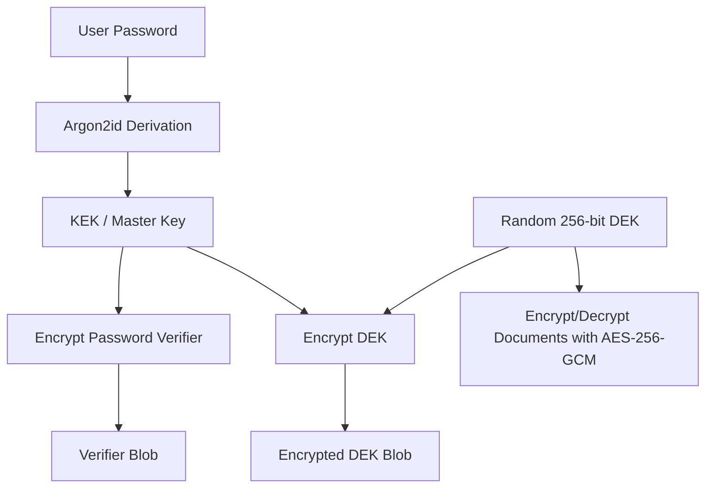
---

## 4. Key Hierarchy
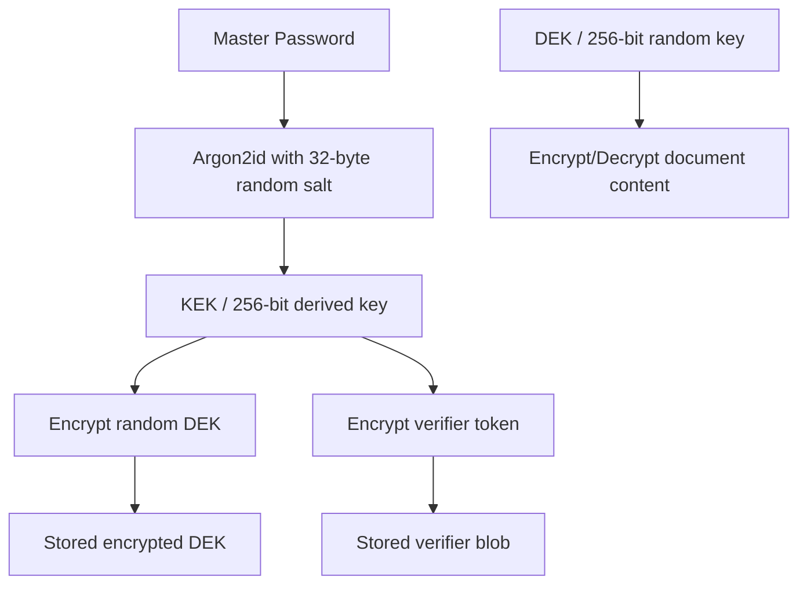

### Why Two Keys?

- **KEK (Key Encryption Key)**: Derived from the user's password. Used only to encrypt/decrypt the DEK. Zeroed from memory after every operation.
- **DEK (Data Encryption Key)**: Random 256-bit key. Used to encrypt/decrypt all document data. Stored encrypted on disk. Can be rotated without changing the password.

### Lifecycle

| Key | Created | Stored | In Memory | Zeroed |
|-----|---------|--------|-----------|--------|
| KEK | Vault unlock | Never | Only during derive/verify | After every operation |
| DEK | Vault creation | Encrypted in secure storage | During unlocked session | On `lockVault()` |

### Key Lifecycle View

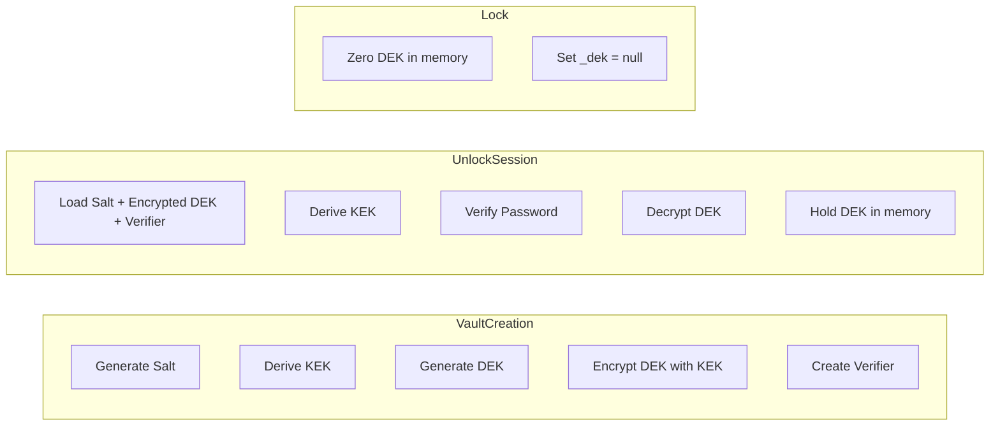


---

## 5. Vault Lifecycle

### 5.1 Vault Creation (`VaultRepository.createVault`)

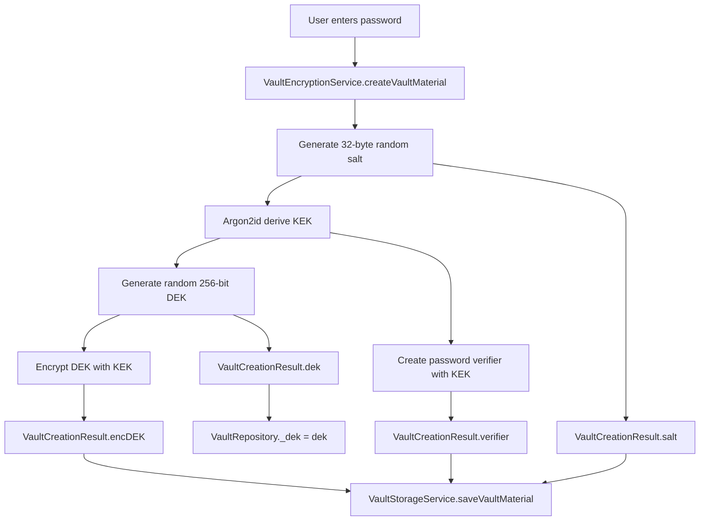

**Storage keys used:**
- `vault_salt` — Base64-encoded 32-byte salt
- `vault_encrypted_dek_blob` — Base64-encoded encrypted DEK
- `vault_password_verifier_blob` — Base64-encoded encrypted verifier

### 5.2 Vault Unlock (`VaultRepository.unlockVault`)

```mermaid
flowchart TD
    U[User enters password] --> A[VaultStorageService.loadVaultMaterial]
    A --> B[Load salt + encrypted DEK + verifier]
    B --> C[deriveKeK(password, salt)]
    C --> D[verifyPassword(kek, verifier)]
    D -->|valid| E[decryptValue(kek, encDEK)]
    D -->|invalid| X[WrongPasswordException]
    E --> F[VaultRepository._dek = dek]
    F --> G[AuthStatus.authenticated]
```

### 5.3 Vault Lock (`VaultRepository.lockVault`)

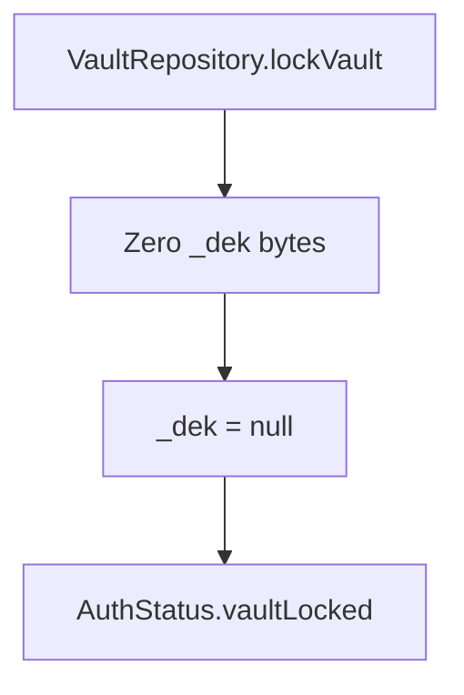

### 5.4 Document Encryption (`VaultRepository.encryptDocument`)

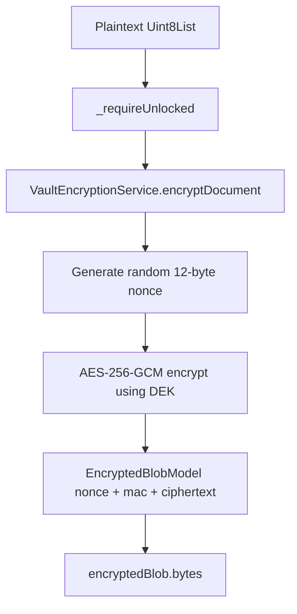

### 5.5 Document Decryption (`VaultRepository.decryptDocument`)

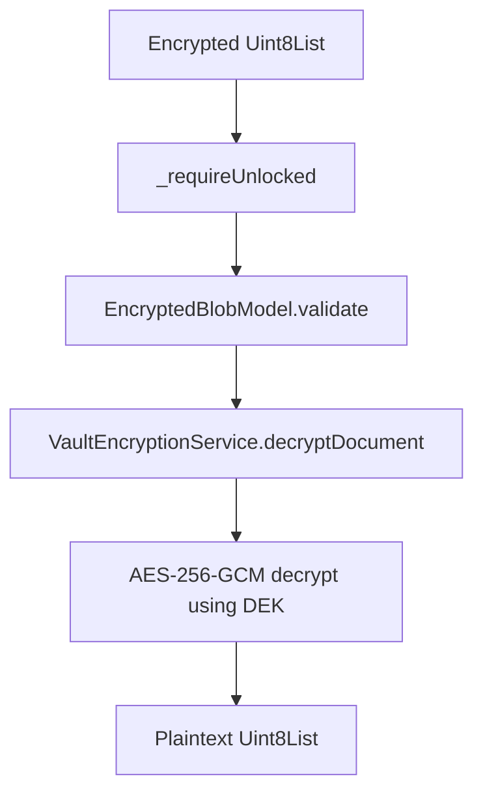

---

## 6. Authentication State Machine

**File:** `features/auth/presentation/cubits/auth_cubit/auth_cubit.dart`

### States

| State | Meaning |
|-------|---------|
| `onboarding` | No vault exists yet; user must create one |
| `unauthenticated` | Vault exists but user is not logged in |
| `authenticated` | Vault is unlocked; DEK is in memory |
| `vaultLocked` | Vault was locked; DEK is zeroed |

### Transitions

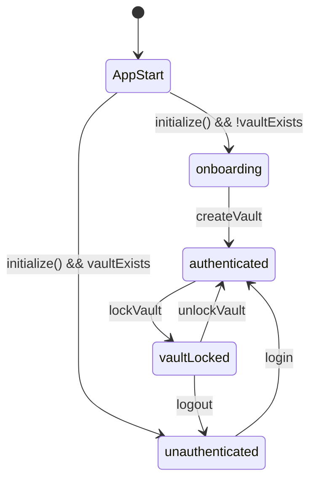

### Design Rules

- `AuthCubit` **never** stores passwords, keys, or performs cryptography
- `AuthCubit` **never** accesses secure storage directly
- All vault operations delegate to `VaultRepository`
- Navigation is handled by `GoRouter` redirect logic that reads `AuthCubit.state`

---

## 7. Storage Layer

### Secure Storage (`flutter_secure_storage`)

Backed by Android Keystore / iOS Keychain. Used **only** for vault metadata.

**Keys defined in `core/storage/secured_storage_keys.dart`:**

| Key | Content | Format |
|-----|---------|--------|
| `vault_salt` | 32-byte Argon2id salt | Base64 |
| `vault_encrypted_dek_blob` | AES-256-GCM encrypted DEK | Base64 |
| `vault_password_verifier_blob` | AES-256-GCM encrypted verifier | Base64 |
| `master_token` | Defined but **unused** | — |

**Implementation notes:**
- `SecureStorageServiceImpl` handles iOS edge cases (empty string detection, multi-attempt deletion with iCloud sync disabled)
- `SecureStorageModule` provides `FlutterSecureStorage` with `iCloudKeychainAccessibility: null` (disabled)

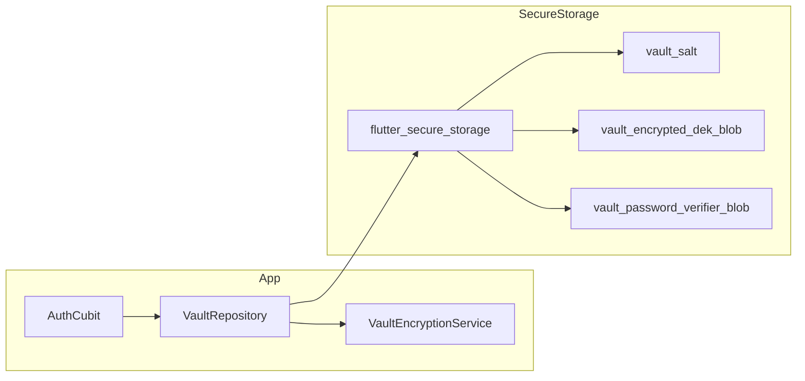
### What lives where
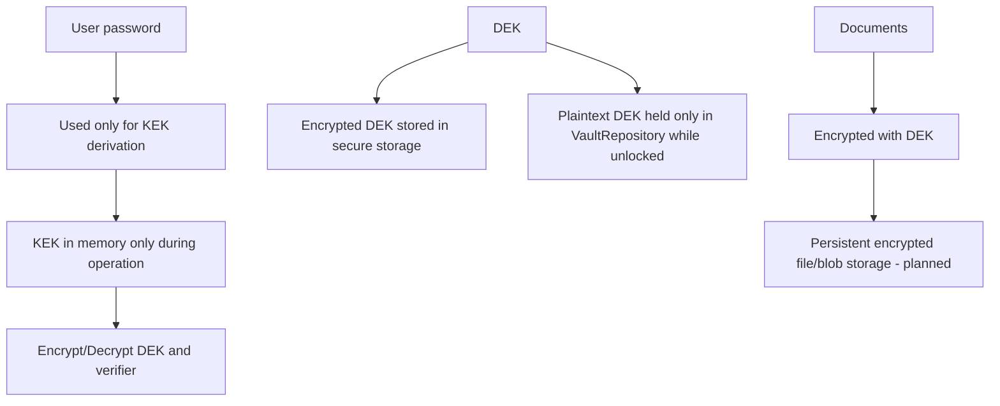

### SharedPreferences

Used for simple app preferences.

**Keys defined in `core/storage/shared_prefs_keys.dart`:**

| Key | Purpose |
|-----|---------|
| `isSignedUp` | Defined but **unused** in active code |

### What Is NOT Implemented

- SQLCipher encrypted metadata database (`sqflite_sqlcipher` not in `pubspec.yaml`)
- File storage (`/vault/docs/`, `/vault/thumbs/`)
- Document model (id, title, type, path, thumbnail, timestamps)

---

## 8. Encrypted Blob Wire Format

**File:** `core/models/encryption/encrypted_blob_model.dart`

Every AES-256-GCM encrypted value is serialized as:

```
Offset 0-11:   Nonce        (12 bytes / 96-bit)
Offset 12-27:  MAC/Tag      (16 bytes)
Offset 28+:    Ciphertext   (N bytes)
              ─────────────
              Total overhead: 28 bytes
``` 
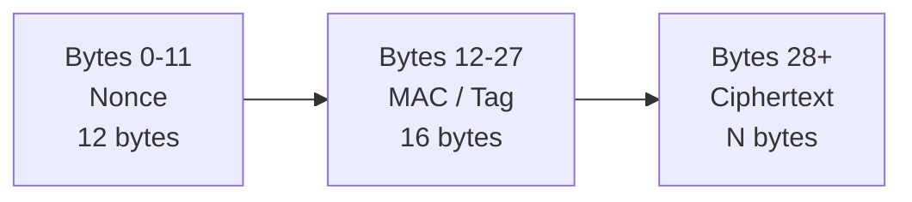

### Model Methods

- `EncryptedBlobModel.fromBytes(Uint8List)` — parse wire format
- `EncryptedBlobModel.parse(Uint8List)` — parse with validation
- `EncryptedBlobModel.validate(Uint8List)` — validate min length (>= 28 bytes)
- `.bytes` — serialize back to wire format

---

## 9. Routing & Navigation

**File:** `core/routes/route_config.dart`

Uses `go_router` with auth-state-based redirects.

### Routes

| Path | Screen | Auth Required |
|------|--------|---------------|
| `/` | Redirect based on auth state | — |
| `/sign-up` | `SignUpScreen` | No (onboarding only) |
| `/login` | `LoginScreen` | No |
| `/home` | `HomeScreen` | Yes |

### Redirect Logic

```
AuthStatus.onboarding     → /sign-up
AuthStatus.unauthenticated → /login
AuthStatus.authenticated   → /home
AuthStatus.vaultLocked     → /login
```

### Navigation Service

`NavigationService` wraps `GoRouter` with route history tracking for back navigation.

---

## 10. Dependency Injection

**File:** `injectables/injectable.dart`

Uses `GetIt` + `injectable` for compile-time DI.

### Registered Singletons

| Class | Scope |
|-------|-------|
| `VaultEncryptionService` | Singleton |
| `VaultStorageService` | Singleton |
| `VaultRepository` | Singleton |
| `AuthCubit` | Factory (new per request) |
| `SecureStorageServiceImpl` | Singleton |
| `SharedPrefsServiceImpl` | Singleton |
| `NavigationService` | Singleton |
| `ResponsiveService` | Singleton |
| `FlutterSecureStorage` | Singleton (via module) |
| `SharedPreferences` | Singleton (via module, pre-resolved) |

### Dependency Relationships

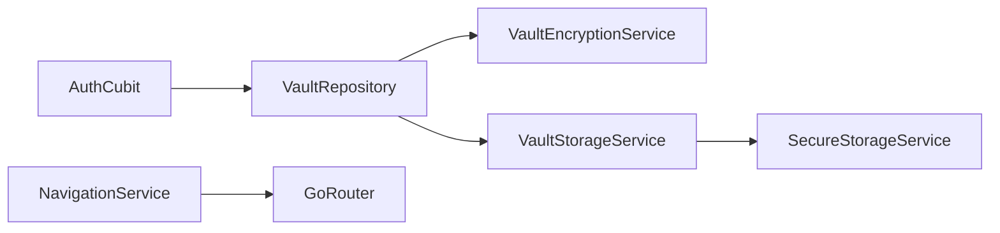

### Bootstrap Flow

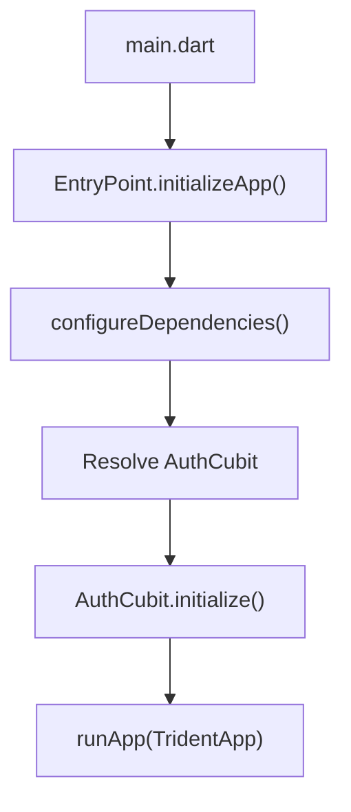

---

## 11. UI Architecture

### High-level UI Architecture
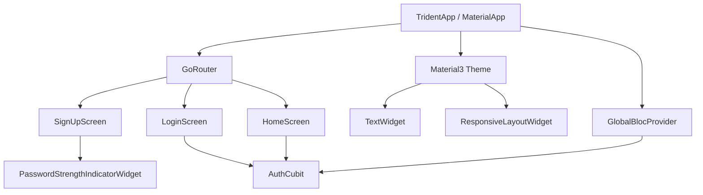
### State ownership
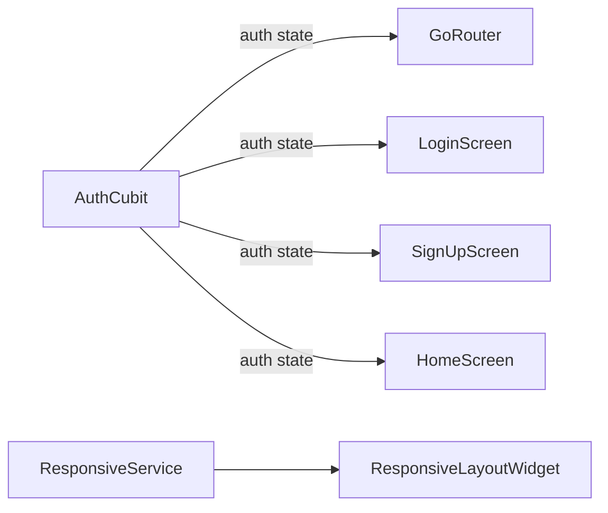

### State Management

- **BLoC/Cubit** pattern via `flutter_bloc`
- `AuthCubit` manages authentication state
- Base states: `NormalState` (Initial/Loading/Success/Failure) and `PaginationState`

### Theme

- Material3 dark theme
- Color palette: muted blue primary, soft green secondary
- Custom `TextWidget` with 15 built-in typography styles
- Custom fonts: GoogleSans (regular + italic)

### Responsive Layout

- `ResponsiveService` detects device type (mobile/tablet), orientation, and width class
- `ResponsiveLayoutWidget` provides breakpoint-based layouts (mobilePortrait, mobileLandscape, tabletPortrait, tabletLandscape)

---

## 12. Dependencies

### Core

| Package | Purpose |
|---------|---------|
| `flutter` | Framework |
| `flutter_bloc` | State management (BLoC/Cubit) |
| `get_it` + `injectable` | Dependency injection |
| `go_router` | Declarative routing |
| `cryptography` | Argon2id + AES-256-GCM |
| `flutter_secure_storage` | Encrypted KV storage (Keystore/Keychain) |
| `flutter_screenutil` | Responsive sizing |
| `shared_preferences` | Simple KV preferences |
| `path_provider` | File system paths |
| `url_launcher` | External URL opening |

### Declared but Unused

| Package | Status |
|---------|--------|
| `local_auth` | Biometric auth — declared, not implemented |
| `fpdart` | Functional programming — declared, never imported |
| `collection` | Declared, only used transitively by `nested` |
| `flutter_windowmanager` | Screenshot protection — commented out |

### Missing (Specified in README but Not in pubspec.yaml)

| Package | Purpose |
|---------|---------|
| `sqflite_sqlcipher` | Encrypted metadata database |
| `file_picker` | Document import |
| `uuid` | Document ID generation |

---

## 13. Security Practices

### Memory Safety

- **KEK zeroing**: `_zero()` method overwrites `Uint8List` with zeros immediately after use
- **DEK lifetime**: Only exists in `VaultRepository._dek`; zeroed on `lockVault()`
- **No plaintext persistence**: Decrypted data exists only in RAM during active operations

### Constant-Time Comparison

Password verification uses `_constantTimeEquals()` — XOR-based comparison to prevent timing side-channel attacks.

### Wrong Password Detection

AES-GCM's built-in MAC verification catches wrong passwords via `SecretBoxAuthenticationError`, which is caught and re-thrown as `WrongPasswordException`.

### Secure Storage

- Android: Backed by Android Keystore
- iOS: Backed by iOS Keychain, iCloud sync disabled
- Never stores documents or decrypted keys — only wrapped key material

### Route Protection

`GoRouter` redirects prevent navigation to protected screens without authentication.

---

## 14. What Is Implemented vs Planned

### Implemented (Working)

- [x] Complete cryptographic core (Argon2id + AES-256-GCM)
- [x] Vault creation flow (password → salt → KEK → DEK → encrypted storage)
- [x] Vault unlock flow (password → derive KEK → verify → decrypt DEK)
- [x] Vault lock (DEK zeroed from memory)
- [x] Password verification via known-plaintext technique
- [x] Auth state machine with all 4 states
- [x] Secure storage layer with iOS edge cases handled
- [x] DI framework with all registrations generated
- [x] GoRouter navigation with auth-guarded routes
- [x] Sign-up screen with real-time password strength indicator
- [x] Login screen with error handling
- [x] Full dark theme design system
- [x] Responsive layout infrastructure
- [x] Reusable widget library
- [x] BLoC state abstractions
- [x] Logger infrastructure

### Not Implemented (Planned)

- [ ] Document import (file_picker not in dependencies)
- [ ] Document storage (no file I/O, no /vault/ directory)
- [ ] Document viewing/decryption for user content
- [ ] SQLCipher encrypted metadata database
- [ ] Document model (id, title, type, path, thumbnail, timestamps)
- [ ] Document export/backup (.vaultbackup format)
- [ ] Backup restore
- [ ] Biometric authentication (local_auth declared but unused)
- [ ] Auto-lock (background detection, idle timeout)
- [ ] Screenshot protection (flutter_windowmanager commented out)
- [ ] Chunk-based encryption for large files
- [ ] Stream-based processing for memory efficiency
- [ ] Root/jailbreak detection
- [ ] Meaningful tests (only default Flutter counter test remains)

---

## 15. Known Issues & Gaps

1. **HomeScreen bug**: Reads `Future<String?>` from secure storage and calls `.toString()`, which displays `Instance of 'Future<String?>'` instead of actual values
2. **`fpdart` dependency**: Declared in pubspec.yaml but never imported
3. **Test coverage**: Only default Flutter counter test exists; no crypto or auth tests
4. **`flutter_windowmanager`**: Commented out in pubspec.yaml; screenshot protection not enforced

---

*This document reflects the codebase as of the current state. Update as new features are implemented.*
