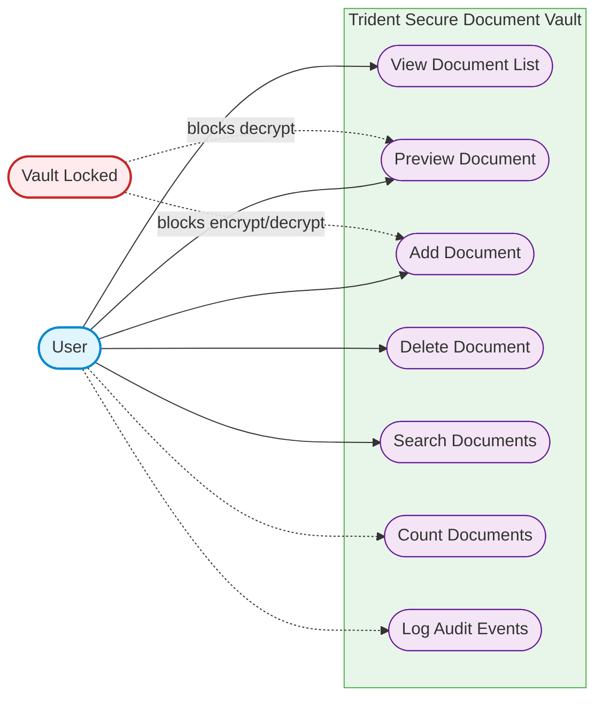
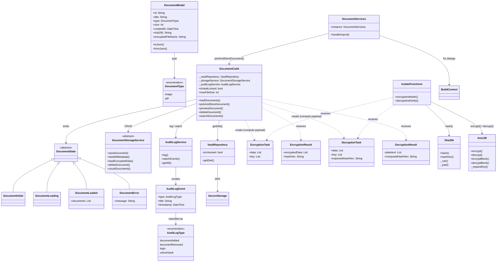
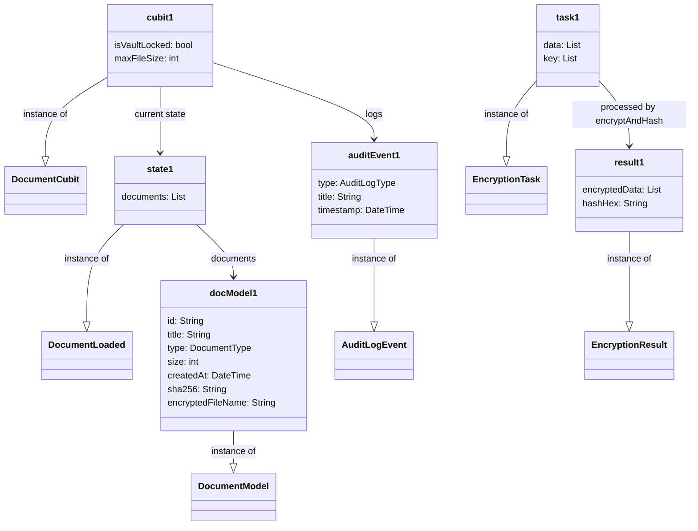
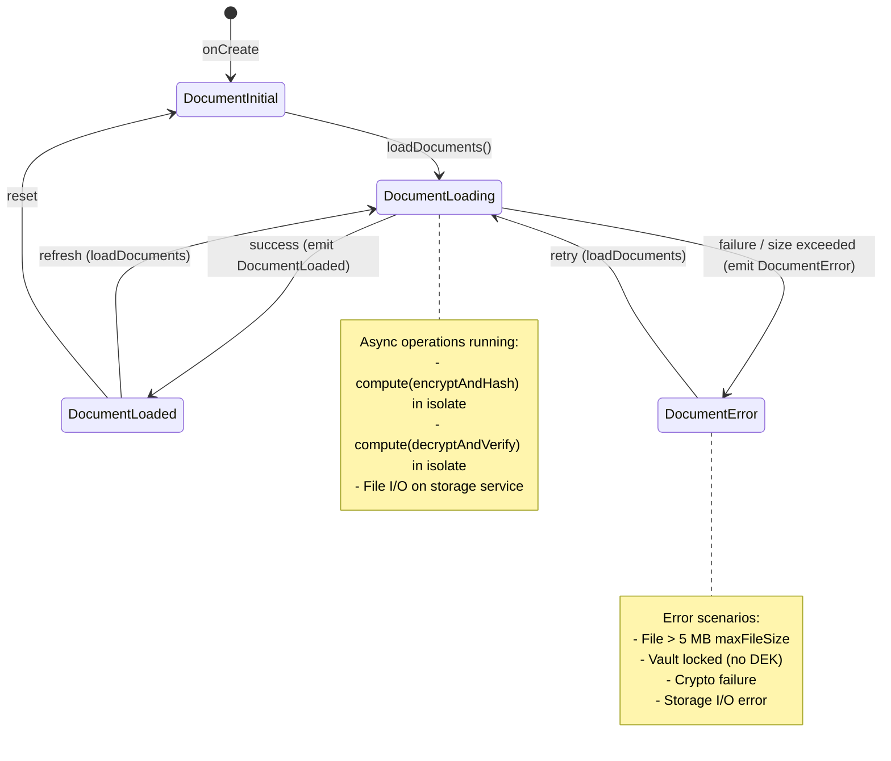
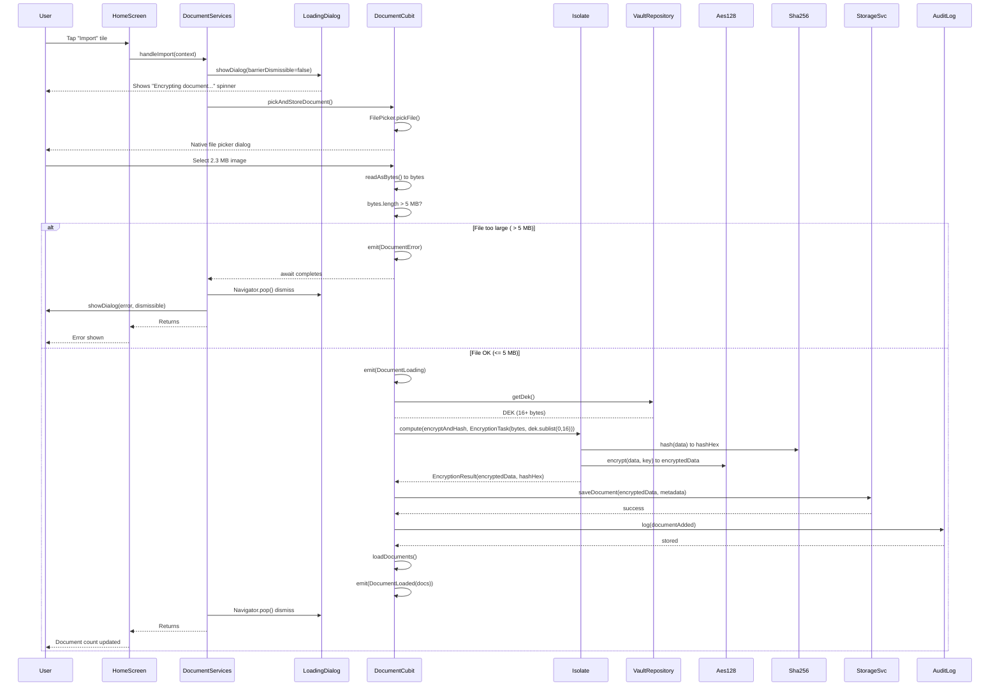
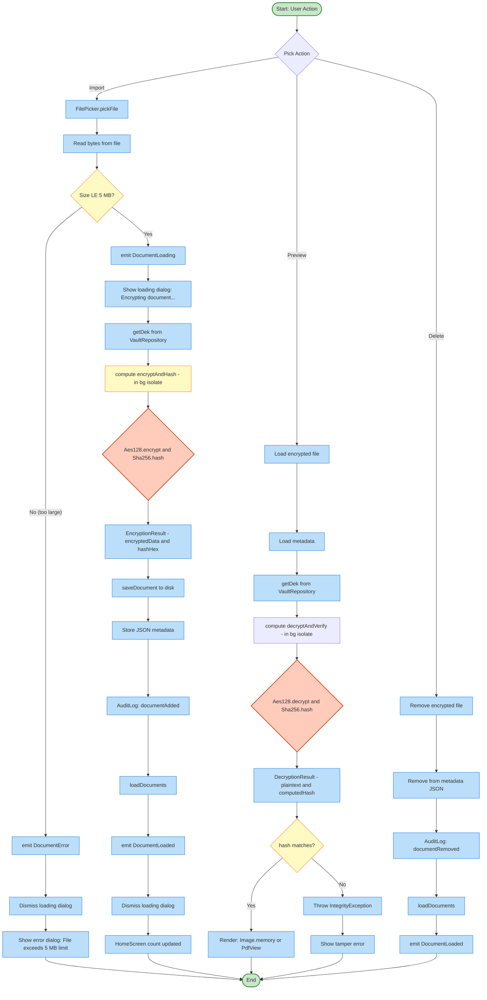
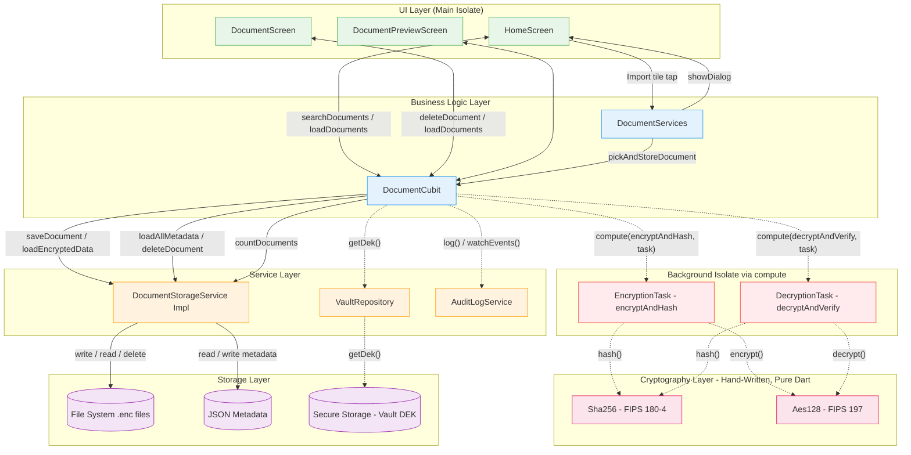
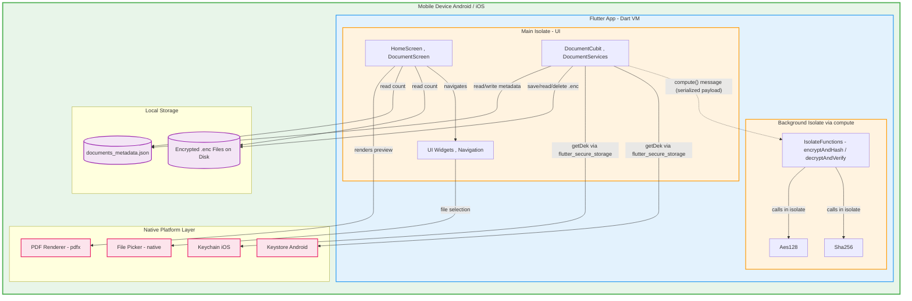

# Trident — System Design Diagrams (Mermaid)

* [ ]

- `lib/features/documents/presentation/cubits/encryption_task.dart`
- `lib/features/documents/presentation/cubits/document_cubit.dart`
- `lib/features/documents/domain/services/document_services.dart`
- `lib/features/documents/domain/models/document_model.dart`
- `lib/core/algorithms/aes_128.dart`
- `lib/core/algorithms/sha256.dart`
- `lib/core/routes/route_config.dart`
- `lib/core/routes/route_names.dart`

---

## 1. Use Case Diagram

---

## 2. Class Diagram

---

## 3. Object Diagram

---

## 4. State Diagram (DocumentCubit)

---

## 5. Sequence Diagram: Adding a Document (Import Flow)

---

## 6. Activity Diagram (Document Lifecycle)

---

## 7. Component Diagram

---

## 8. Deployment Diagram

---

## Diagram Summary

| # | Diagram Type | Mermaid Syntax                   | Key Elements                                     |
| - | ------------ | -------------------------------- | ------------------------------------------------ |
| 1 | Use Case     | `graph LR`                     | 7 use cases, 2 actors, vault-blocked constraints |
| 2 | Class        | `classDiagram`                 | 18 classes, full inheritance + dependency graph  |
| 3 | Object       | `classDiagram` with `object` | 7 instances showing runtime state                |
| 4 | State        | `stateDiagram-v2`              | 4 DocumentCubit states, 5 transitions            |
| 5 | Sequence     | `sequenceDiagram`              | 9 participants, import flow with isolate         |
| 6 | Activity     | `graph TD`                     | Full lifecycle: Add, Store, Preview, Delete      |
| 7 | Component    | `graph TB`                     | 4 layers + isolate, 6 component groups           |
| 8 | Deployment   | `graph TB`                     | 2 isolates, native layer, local storage          |

*Generated from live codebase analysis — all class names, method signatures, and relationships match the actual Dart source.*
