# Trident Developer Guide

Internal documentation covering the current implementation, data flows, cryptographic model, and architecture of the Trident encrypted document vault.

---

## Table of Contents

1. [Project Overview](#1-project-overview)
2. [Project Structure](#2-project-structure)
3. [Cryptographic Architecture](#3-cryptographic-architecture)
4. [Key Hierarchy](#4-key-hierarchy)
5. [Vault Lifecycle](#5-vault-lifecycle)
6. [Authentication State Machine](#6-authentication-state-machine)
6A. [Authentication Flows](#6a-authentication-flows)
7. [Storage Layer](#secure-storage)
8. [Encrypted Blob Wire Format](#8-encrypted-blob-wire-format)
9. [Routing &amp; Navigation](#9-routing--navigation)
10. [Dependency Injection](#10-dependency-injection)
11. [UI Architecture](#11-ui-architecture)
12. [Dependencies](#12-dependencies)
13. [Security Practices](#13-security-practices)
14. [What Is Implemented vs Planned](#14-what-is-implemented-vs-planned)
15. [Known Issues &amp; Gaps](#15-known-issues--gaps)

---

## 1. Project Overview

Trident is an **offline-first encrypted document vault** built with Flutter. The core invariant is:

> Everything is encrypted before leaving memory boundaries. No plaintext persistence outside RAM during active operations.

The app allows users to create a password-protected vault, derive cryptographic keys from that password, and encrypt/decrypt document data using AES-256-GCM. The vault metadata (salt, encrypted DEK, password verifier) is stored in platform-native secure storage (Android Keystore / iOS Keychain).

---

## 2. Project Structure

```
lib/
├── main.dart                          # App entry point
├── entry_point.dart                   # DI initialization + app bootstrap
├── main_screen.dart                   # Root MaterialApp widget
│
├── injectables/
│   ├── injectable.dart                # GetIt configuration bootstrap
│   └── injectable.config.dart         # GENERATED DI registration code
│
├── core/
│   ├── constants/
│   │   └── app_colors.dart            # Dark-theme color palette
│   │
│   ├── extensions/
│   │   ├── app_extensions.dart         # BuildContext + String extensions
│   │   └── widget_extension.dart       # .onTap() and .padding() helpers
│   │
│   ├── models/
│   │   ├── failure_model.dart          # Generic failure/error model
│   │   ├── encryption/
│   │   │   ├── encrypted_blob_model.dart          # AES-GCM wire format model
│   │   │   └── vault_creation_result_model.dart   # Vault creation output DTO
│   │   └── device_responsive/
│   │       ├── device_type_model.dart              # Device type enums
│   │       └── responsive_layout_info_model.dart   # Responsive layout info
│   │
│   ├── routes/
│   │   ├── route_config.dart           # GoRouter config with auth redirects
│   │   ├── route_names.dart            # Route path constants
│   │   └── go_router_refresh_stream.dart
│   │
│   ├── services/
│   │   ├── biometric/
│   │   │   ├── biometric.dart                     # Barrel export
│   │   │   ├── biometric_service.dart             # Biometric abstraction
│   │   │   └── biometric_service_impl.dart        # local_auth plugin wrapper
│   │   ├── device_responsive/
│   │   │   └── responsive_service.dart
│   │   ├── encryption/
│   │   │   └── vault_encryption/
│   │   │       ├── vault_encryption_service.dart   # Core crypto engine
│   │   │       ├── vault_repository.dart           # DEK lifecycle owner
│   │   │       └── vault_storage_service.dart      # Vault metadata + biometric persistence
│   │   ├── navigation/
│   │   │   └── navigation_service.dart
│   │   └── state/
│   │       ├── normal_state.dart       # Base BLoC state
│   │       └── pagination_state.dart   # Paginated state
│   │
│   ├── storage/
│   │   ├── secured_storage_keys.dart   # Secure storage key constants
│   │   ├── shared_prefs_keys.dart      # SharedPreferences key constants
│   │   ├── secure_storage/
│   │   │   ├── secure_storage_service.dart
│   │   │   ├── secure_storage_service_impl.dart
│   │   │   └── secure_storage_module.dart
│   │   └── shared_preferences/
│   │       ├── shared_prefs_service.dart
│   │       ├── shared_prefs_service_impl.dart
│   │       └── shared_prefs_module.dart
│   │
│   ├── utils/
│   │   ├── app_imports.dart            # Barrel file for common deps
│   │   ├── global_bloc_provider.dart   # MultiBlocProvider wrapper
│   │   ├── logger/app_logger.dart      # Debug logger
│   │   ├── textStyle/text_style_utils.dart
│   │   └── theme/theme.dart            # Material3 dark theme
│   │
│   └── widgets/                        # Reusable UI components
│       ├── text/text_widget.dart
│       ├── screen_padding.dart
│       ├── dimiss_keyboard_widget.dart
│       └── device_responsive/responsive_widget.dart
│
└── features/
    └── auth/
        ├── domains/
        │   ├── models/
        │   │   └── password_requirements_model.dart
        │   └── services/
        │       └── password_validator_service.dart
        └── presentation/
            ├── cubits/auth_cubit/
            │   └── auth_cubit.dart     # Auth state machine
            ├── screens/
            │   ├── home_screen.dart    # Placeholder (debug view)
            │   ├── login_screen.dart
            │   └── sign_up_screen.dart
            └── widgets/
                └── password_strength_indicator_widget.dart
```

---

## 3. Cryptographic Architecture

### Algorithms

| Operation                | Algorithm             | Library          | Parameters                                                          |
| ------------------------ | --------------------- | ---------------- | ------------------------------------------------------------------- |
| Key Derivation           | **Argon2id**    | `cryptography` | Memory: 64 MB, Iterations: 3, Parallelism: 1, Hash length: 32 bytes |
| Symmetric Encryption     | **AES-256-GCM** | `cryptography` | 256-bit key, 96-bit (12-byte) random nonce                          |
| Password Verification    | Known-plaintext       | AES-256-GCM      | Encrypts`'TRIDENT_VAULT_V1_OK'` with KEK                          |
| Biometric DEK Encryption | **AES-256-GCM** | `cryptography` | 256-bit BUK as key, 96-bit random nonce (same as KEK path)          |

### Implementation File

**`core/services/encryption/vault_encryption/vault_encryption_service.dart`**

This is the cryptographic engine. It exposes:

- `createVaultMaterial(password)` — full vault creation (salt, KEK, DEK, encrypted blobs)
- `unlockVault(masterPassword, salt, encryptedDekBlob, passwordVerifierBlob)` — derives KEK, verifies password, decrypts DEK
- `encryptDocument(plaintext, dek)` — document encryption via DEK
- `decryptDocument(blob, dek)` — document decryption via DEK

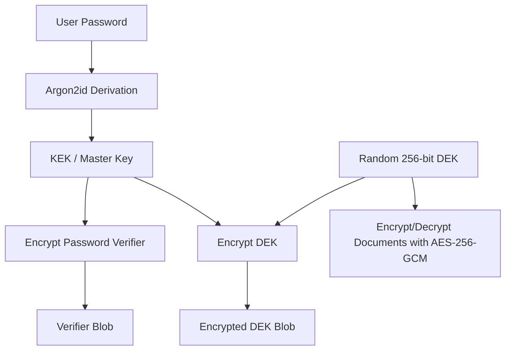

---

## 4. Key Hierarchy

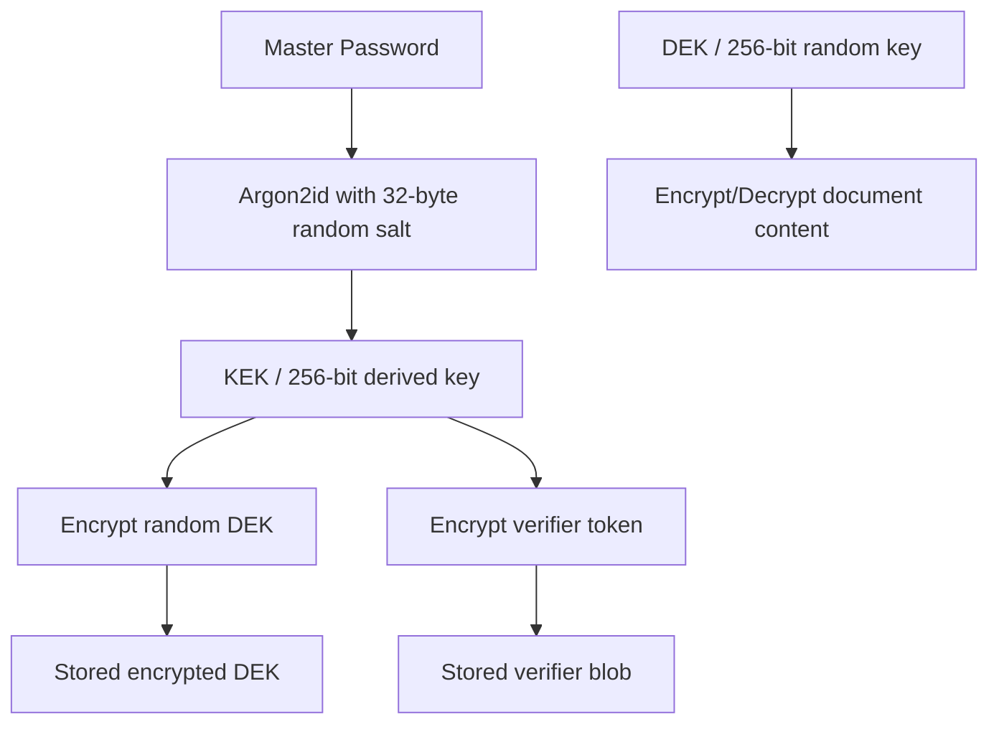

### Why Two Keys?

- **KEK (Key Encryption Key)**: Derived from the user's password. Used only to encrypt/decrypt the DEK. Zeroed from memory after every operation.
- **DEK (Data Encryption Key)**: Random 256-bit key. Used to encrypt/decrypt all document data. Stored encrypted on disk. Can be rotated without changing the password.

### Biometric Key: BUK

| Key           | Name                 | Purpose                                                                                                                                        |
| ------------- | -------------------- | ---------------------------------------------------------------------------------------------------------------------------------------------- |
| **BUK** | Biometric Unlock Key | 256-bit random key. Encrypts the DEK specifically for biometric unlock. Stored raw in platform secure storage alongside the BUK-encrypted DEK. |

**Flow:** `Enable Biometric` → generate BUK → encrypt DEK with BUK → store both in secure storage.
`Biometric Unlock` → biometric auth → read BUK from secure storage → decrypt DEK with BUK → zero BUK.

### Lifecycle

| Key | Created                 | Stored                                                          | In Memory                            | Zeroed                           |
| --- | ----------------------- | --------------------------------------------------------------- | ------------------------------------ | -------------------------------- |
| KEK | Vault unlock            | Never                                                           | Only during derive/verify            | After every operation            |
| DEK | Vault creation          | Encrypted in secure storage (×2: once with KEK, once with BUK) | During unlocked session              | On`lockVault()`                |
| BUK | On`enableBiometric()` | Raw in secure storage                                           | During`unlockWithBiometric()` only | Immediately after DEK decryption |

### Key Lifecycle View

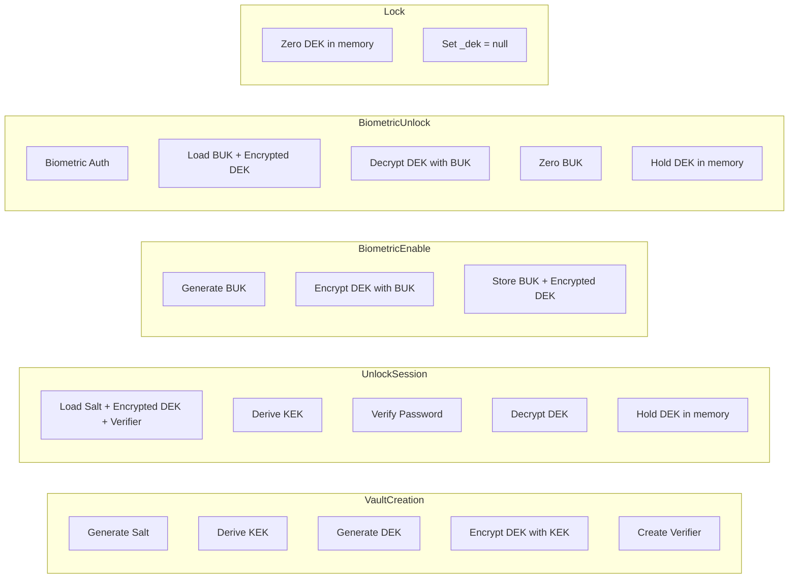

---

## 5. Vault Lifecycle

### 5.1 Vault Creation — `VaultRepository.createVault(masterPassword)`

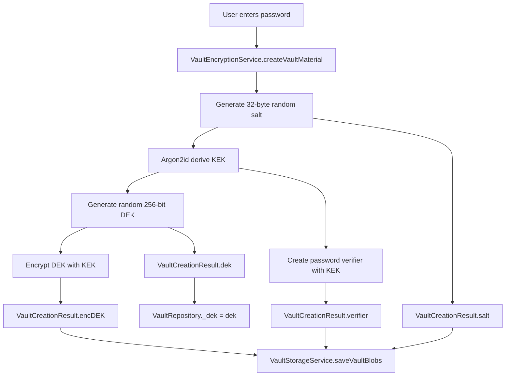

**Sequential execution order (in code):**

1. `AuthCubit.createVault(password)` — called by `SignUpScreen._onSignUp()`
2. → `VaultRepository.createVault(password)` — guards against existing vault, handles stale/corrupted metadata edge cases
3. → `VaultEncryptionService.createVaultMaterial(password)` — generates salt, derives KEK via Argon2id, generates random DEK, encrypts DEK with KEK, creates password verifier
4. → `VaultStorageService.saveVaultBlobs(salt, encryptedDekBlob, verifierBlob)` — saves 3 blobs to secure storage in parallel
5. ← `VaultRepository._dek = result.dek` — holds plaintext DEK in memory
6. ← `AuthCubit` emits `AuthStatus.authenticated`
7. ← GoRouter redirects to `/home`

**Storage keys written:**

- `vault_salt` — Base64-encoded 32-byte salt
- `vault_encrypted_dek_blob` — Base64-encoded encrypted DEK
- `vault_password_verifier_blob` — Base64-encoded encrypted verifier

### 5.2 Vault Unlock (Master Password) — `VaultRepository.unlockVault(masterPassword)`

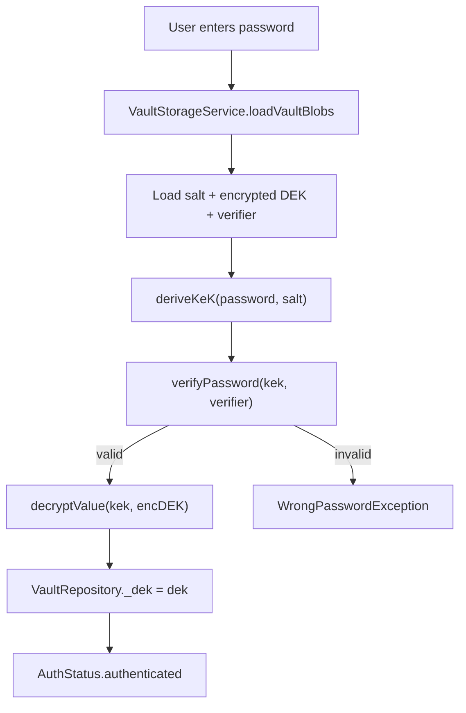

**Sequential execution order (in code):**

1. `LoginScreen._login()` — reads password from `TextEditingController`, sets loading state
2. → `AuthCubit.login(masterPassword)` — delegates to `VaultRepository`
3. → `VaultRepository.unlockVault(masterPassword)` — loads blobs, throws `StateError` if no vault
4. → `VaultStorageService.loadVaultBlobs()` — parallel reads salt, encrypted DEK, verifier from secure storage. Returns `null` if vault doesn't exist, throws `VaultCorruptedException` if any field is missing/empty
5. → `VaultEncryptionService.unlockVault(password, salt, encDekBlob, verifierBlob)` — derives KEK via Argon2id, decrypts verifier blob, constant-time compares against known plaintext `'TRIDENT_VAULT_V1_OK'`. On mismatch → throws `WrongPasswordException`. On match → decrypts DEK blob with KEK
6. ← `VaultRepository._dek = dek` — plaintext DEK held in memory
7. ← `AuthCubit` emits `AuthStatus.authenticated`
8. ← `GoRouter` redirects to `/home`
9. ← `LoginScreen BlocListener` detects state change, also calls `NavigationService.pushAndRemoveUntil('/home')`

### 5.3 Vault Lock — `VaultRepository.lockVault()`

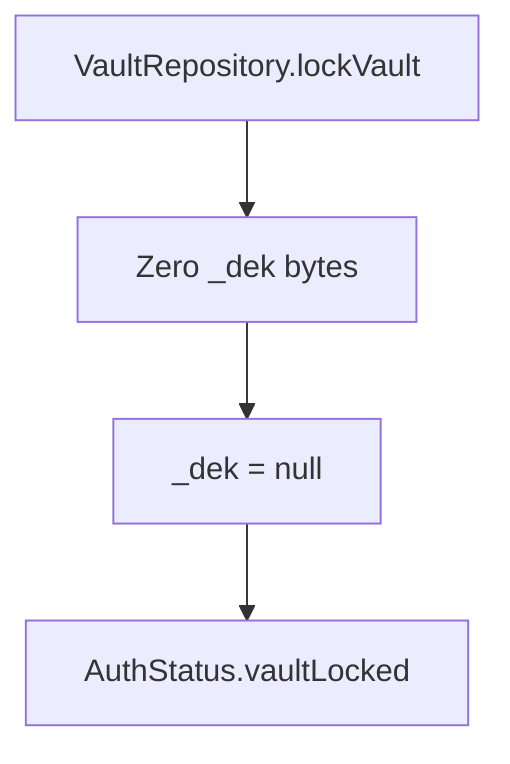

**Sequential execution order (in code):**

1. `HomeScreen._lockVault()` — called from lock button or could be called from AppLifecycle listener
2. → `AuthCubit.lockVault()` — guards: no-op if state is not `authenticated`
3. → `VaultRepository.lockVault()` — iterates over every byte of `_dek` and sets to 0, then sets `_dek = null`
4. ← `AuthCubit` emits `AuthStatus.vaultLocked`
5. ← `GoRouter` redirects to `/login`
6. ← `NavigationService.pushAndRemoveUntil('/login')`

### 5.5 Vault Deletion (Account Deletion) — `VaultRepository.deleteVault()`

```mermaid
flowchart TD
    A[HomeScreen: Delete Account button] --> B[DeleteAccountScreen: type "DELETE" to confirm]
    B --> C[AuthCubit.deleteAccount]
    C --> D[VaultRepository.deleteVault]
    D --> E[Zero _dek bytes if in memory]
    E --> F[_dek = null]
    F --> G[VaultStorageService.deleteAllVaultData]
    G --> H[Parallel delete: salt, encryptedDEK, verifier, biometricEnabled, biometricEncryptedDEK, biometricUnlockKey]
    H --> I[AuthCubit emits onboarding]
    I --> J[GoRouter redirects to /sign-up]
```

**Sequential execution order (in code):**

1. `HomeScreen` — user taps "Delete Account" in the Vault Actions section
2. → `NavigationService.navigateTo('/delete-account')` — navigates to confirmation screen
3. `DeleteAccountScreen` — user types "DELETE" in the confirmation field and taps "Delete Vault"
4. → `AuthCubit.deleteAccount()` — calls `VaultRepository.deleteVault()`
5. → `VaultRepository.deleteVault()`:
   a. If `_dek` is non-null (vault is unlocked): iterates over every byte and sets to 0, then `_dek = null`
   b. Calls `_storage.deleteAllVaultData()` — parallel deletion of all 6 secure storage keys:
      - `vault_salt`
      - `vault_encrypted_dek_blob`
      - `vault_password_verifier_blob`
      - `biometric_enabled`
      - `biometric_encrypted_dek`
      - `biometric_unlock_key`
6. ← `AuthCubit` emits `AuthStatus.onboarding`
7. ← `GoRouter` redirect detects `onboarding` → redirects to `/sign-up`
8. ← `DeleteAccountScreen` BlocListener also navigates to `/sign-up` as a fallback
9. ← Navigation stack is cleared (`pushAndRemoveUntil`) so back button cannot return

**Security notes:**
- The DEK is zeroed from memory before deletion just like `lockVault()`
- All biometric keys (BUK, bDEK) are destroyed — biometric unlock is permanently disabled
- No vault metadata survives — the vault is unrecoverable
- The user must create a new vault from scratch (onboarding flow)

### 5.4 Vault Unlock (Biometric) — `VaultRepository.unlockWithBiometric()`

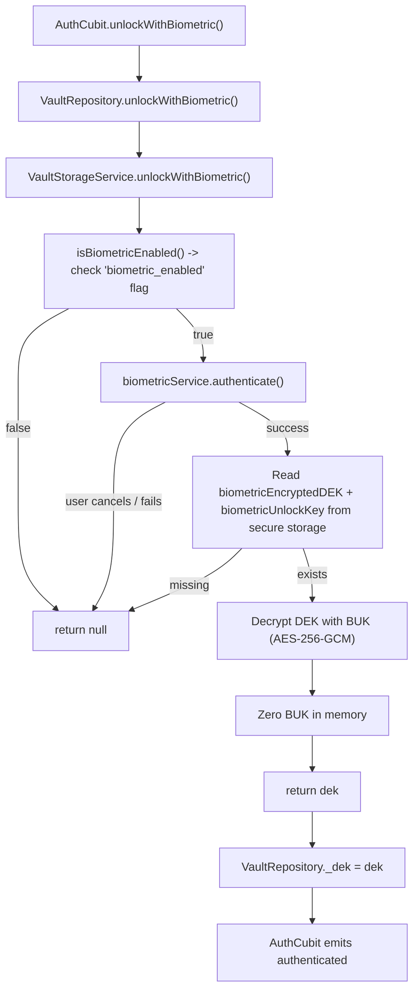

### 5.5 Biometric Enable — `VaultRepository.enableBiometric()`

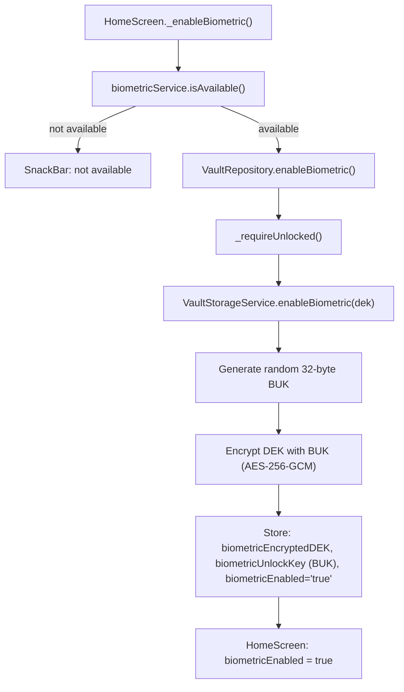

### 5.6 Biometric Disable — `VaultRepository.disableBiometric()`

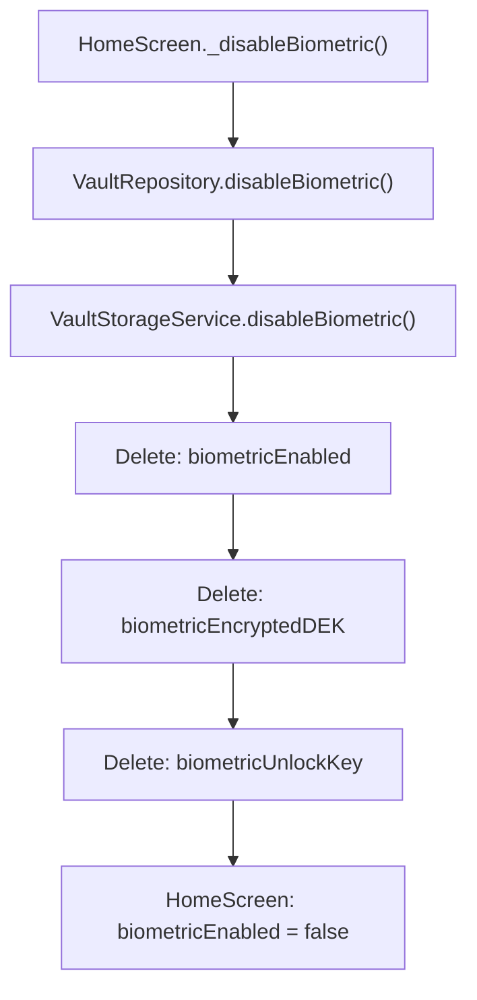

### 5.7 Document Encryption (`VaultRepository.encryptDocument`)

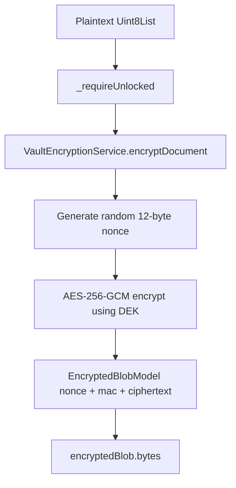

### 5.8 Document Decryption (`VaultRepository.decryptDocument`)

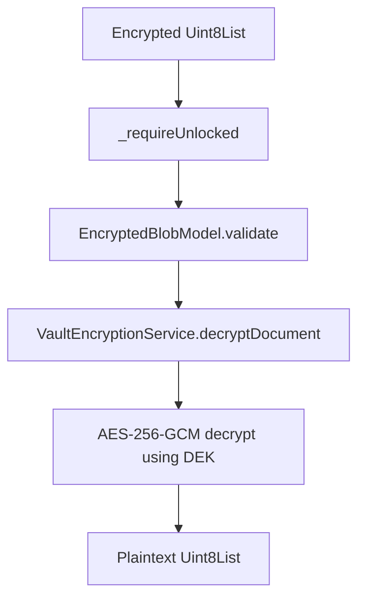

---

## 6. Authentication State Machine

**File:** `features/auth/presentation/cubits/auth_cubit/auth_cubit.dart`

### States

| State               | Meaning                                   |
| ------------------- | ----------------------------------------- |
| `onboarding`      | No vault exists yet; user must create one |
| `unauthenticated` | Vault exists but user is not logged in    |
| `authenticated`   | Vault is unlocked; DEK is in memory       |
| `vaultLocked`     | Vault was locked; DEK is zeroed           |

### Transitions

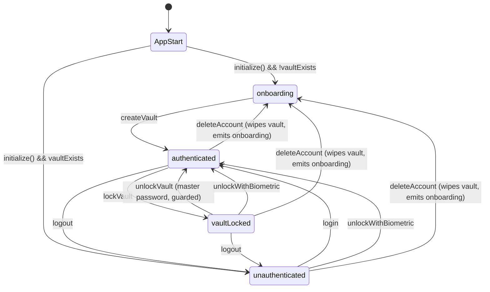

### Biometric-specific transitions

| From                | To                | Trigger                                                                                                                               |
| ------------------- | ----------------- | ------------------------------------------------------------------------------------------------------------------------------------- |
| `vaultLocked`     | `authenticated` | `unlockWithBiometric()` — user was authenticated, vault got locked, biometric data still exists in secure storage                  |
| `unauthenticated` | `authenticated` | `unlockWithBiometric()` — user logged out, but biometric data persists in secure storage. Biometric bypasses master password entry |

### AuthCubit API — Full Method Reference

```dart
// App startup
Future<void> initialize()          // checks vaultExists → emits onboarding or unauthenticated

// Onboarding
Future<void> createVault(String)   // creates vault + emits authenticated

// Login
Future<void> login(String)         // master password unlock → emits authenticated

// Lock
void lockVault()                   // zeros DEK → emits vaultLocked

// Unlock (master password, from vaultLocked)
Future<void> unlockVault(String)   // same as login but guards for vaultLocked state

// Biometric
Future<bool> isBiometricAvailable() // delegates to BiometricService.isAvailable()
Future<bool> isBiometricEnabled()   // delegates to VaultRepository.isBiometricEnabled()
Future<void> enableBiometric()      // encrypts DEK with BUK, stores in secure storage
Future<void> disableBiometric()     // deletes biometric keys from secure storage
Future<bool> unlockWithBiometric()  // biometric auth → decrypt DEK → emit authenticated

// Logout
void logout()                      // locks vault + emits unauthenticated

// Account deletion
void deleteAccount()               // zeros DEK, wipes all secure storage, emits onboarding
```

### Design Rules

- `AuthCubit` **never** stores passwords, keys, or performs cryptography
- `AuthCubit` **never** accesses secure storage directly
- All vault operations delegate to `VaultRepository`
- Navigation is handled by `GoRouter` redirect logic that reads `AuthCubit.state`

---

## 6A. Authentication Flows — Detailed Sequential Execution

This section provides a **line-by-line sequential walkthrough** of every function call, data transformation, and state change for both authentication paths. Use this as the single source of truth instead of re-reading the code.

---

### 6A.1 Master Password Authentication Flow

#### 6A.1.1 Vault Creation (Sign Up)

**Trigger:** User fills password fields on `SignUpScreen` and taps "Create Vault".

```
SignUpScreen._onSignUp()
  │
  ├─ 1. Validates form (password strength, confirm password match)
  ├─ 2. Sets _isLoading = true
  ├─ 3. Calls getIt<AuthCubit>().createVault(masterPassword)
  │
  ▼
AuthCubit.createVault(masterPassword)             [auth_cubit.dart:75]
  │
  ├─ 4. Delegates to _vaultRepository.createVault(masterPassword)
  │
  ▼
VaultRepository.createVault(masterPassword)       [vault_repository.dart:43]
  │
  ├─ 5. Checks _storage.vaultExists()
  │     └─ VaultStorageService.vaultExists() → reads 'vault_salt' from secure storage
  │
  ├─ 6. If vault exists:
  │     ├─ 6a. Tries _storage.loadVaultBlobs() to verify vault is healthy
  │     ├─ 6b. If healthy → throws StateError (refuse to overwrite)
  │     ├─ 6c. If VaultCorruptedException or null → wipes metadata with deleteVaultMetadata()
  │     └─ 6d. Falls through to fresh creation
  │
  ├─ 7. Calls _crypto.createVaultMaterial(masterPassword)
  │
  ▼
VaultEncryptionService.createVaultMaterial(password)  [vault_encryption_service.dart:52]
  │
  ├─ 8. salt = _randomBytes(32)           → 32 random bytes
  ├─ 9. kek = _deriveKek(password, salt)
  │     └─ Argon2id.deriveKeyFromPassword(password, salt)
  │        Parameters: memory=64MB, iterations=3, parallelism=1, hashLength=32
  │        Returns: 256-bit KEK as Uint8List(32)
  │
  ├─ 10. dek = _randomBytes(32)           → 32 random bytes (256-bit DEK)
  │
  ├─ 11. encryptedDekBlob = _encrypt(kek, dek)
  │      └─ AES-256-GCM with random 12-byte nonce
  │      └─ Wire format: [nonce(12) | mac(16) | ciphertext]
  │      └─ Returns EncryptedBlobModel
  │
  ├─ 12. verifierBlob = _encrypt(kek, 'TRIDENT_VAULT_V1_OK'.codeUnits)
  │      └─ Same AES-256-GCM encrypt
  │
  ├─ 13. _zero(kek)                       → KEK overwritten with zeros
  │
  ├─ 14. Returns VaultCreationResultModel:
  │      { salt, encryptedDekBlob, passwordVerifierBlob, dek }
  │
  ◄── back to VaultRepository
  │
  ├─ 15. _storage.saveVaultBlobs(salt, encryptedDekBlob, verifierBlob)
  │
  ▼
VaultStorageService.saveVaultBlobs(...)             [vault_storage_service.dart:39]
  │
  ├─ 16. deleteVaultMetadata()            → deletes all 3 old vault keys
  ├─ 17. Future.wait([...])               → parallel writes:
  │     ├─ writeSecureData('vault_salt', base64Encode(salt))
  │     ├─ writeSecureData('vault_encrypted_dek_blob', base64Encode(encryptedDekBlob.bytes))
  │     └─ writeSecureData('vault_password_verifier_blob', base64Encode(verifierBlob.bytes))
  │
  ◄── back to VaultRepository
  │
  ├─ 18. _dek = result.dek               → plaintext DEK held in memory
  │
  ◄── back to AuthCubit
  │
  ├─ 19. emit(AuthStatus.authenticated)
  │
  ◄── back to SignUpScreen
  │
  ├─ 20. NavigationService.pushAndRemoveUntil('/home')
  ├─ 21. GoRouter redirect detects authenticated → shows HomeScreen
  ├─ 22. _isLoading = false
```

#### 6A.1.2 Vault Unlock (Login)

**Trigger:** User enters master password on `LoginScreen` and taps "Access Vault".

```
LoginScreen._login()                                 [login_screen.dart:50]
  │
  ├─ 1. formKey.currentState?.validate()    → checks non-empty password
  ├─ 2. Sets _isLoading = true, _errorMessage = null
  ├─ 3. Calls getIt<AuthCubit>().login(masterPassword)
  │
  ▼
AuthCubit.login(masterPassword)                      [auth_cubit.dart:89]
  │
  ├─ 4. Delegates to _vaultRepository.unlockVault(masterPassword)
  │
  ▼
VaultRepository.unlockVault(masterPassword)          [vault_repository.dart:89]
  │
  ├─ 5. blobs = _storage.loadVaultBlobs()
  │
  ▼
VaultStorageService.loadVaultBlobs()                  [vault_storage_service.dart:70]
  │
  ├─ 6. vaultExists() → reads 'vault_salt'
  ├─ 7. Future.wait([...])               → parallel reads:
  │     ├─ readSecureData('vault_salt')                    → base64 string
  │     ├─ readSecureData('vault_encrypted_dek_blob')      → base64 string
  │     └─ readSecureData('vault_password_verifier_blob')  → base64 string
  │
  ├─ 8. If any result is null or empty → throws VaultCorruptedException
  ├─ 9. Decodes each from base64 → Uint8List
  ├─ 10. Parses encrypted blobs → EncryptedBlobModel.validate()
  ├─ 11. Returns VaultBlobs { salt, encryptedDekBlob, passwordVerifierBlob }
  │
  ◄── back to VaultRepository
  │
  ├─ 12. Calls _crypto.unlockVault(masterPassword, blobs.salt, blobs.encryptedDekBlob, blobs.passwordVerifierBlob)
  │
  ▼
VaultEncryptionService.unlockVault(...)               [vault_encryption_service.dart:84]
  │
  ├─ 13. kek = _deriveKek(password, salt)
  │       └─ Argon2id.deriveKeyFromPassword(password, salt)
  │          Parameters: memory=64MB, iterations=3, parallelism=1, hashLength=32
  │          Returns: 256-bit KEK as Uint8List(32)
  │
  ├─ 14. Verify password:
  │     ├─ decryptedVerifier = _decrypt(kek, passwordVerifierBlob)
  │     │   └─ AES-256-GCM decrypt with KEK
  │     │   └─ If MAC fails → SecretBoxAuthenticationError → catch → WrongPasswordException
  │     ├─ matches = _constantTimeEquals(decryptedVerifier, 'TRIDENT_VAULT_V1_OK')
  │     │   └─ XOR-based comparison (no short-circuit)
  │     └─ If !matches → _zero(kek) → throw WrongPasswordException
  │
  ├─ 15. dek = _decrypt(kek, encryptedDekBlob)
  │       └─ AES-256-GCM decrypt with KEK
  │
  ├─ 16. _zero(kek)                        → KEK overwritten with zeros
  ├─ 17. Returns dek (plaintext Uint8List(32))
  │
  ◄── back to VaultRepository
  │
  ├─ 18. _dek = dek                        → plaintext DEK held in memory
  │
  ◄── back to AuthCubit
  │
  ├─ 19. emit(AuthStatus.authenticated)
  │
  ◄── back to LoginScreen
  │
  ├─ 20. BlocListener detects authenticated state
  ├─ 21. NavigationService.pushAndRemoveUntil('/home')
  ├─ 22. GoRouter redirect confirms authenticated → shows HomeScreen
  ├─ 23. _isLoading = false
```

#### 6A.1.3 Vault Lock

**Trigger:** User taps lock button on `HomeScreen`.

```
HomeScreen._lockVault()                              [home_screen.dart:116]
  │
  ├─ 1. getIt<AuthCubit>().lockVault()
  │
  ▼
AuthCubit.lockVault()                                [auth_cubit.dart:98]
  │
  ├─ 2. Guard: if (state != AuthStatus.authenticated) return
  ├─ 3. _vaultRepository.lockVault()
  │
  ▼
VaultRepository.lockVault()                          [vault_repository.dart:110]
  │
  ├─ 4. For i in 0.._dek.length-1: _dek![i] = 0    → zero every byte
  ├─ 5. _dek = null
  │
  ◄── back to AuthCubit
  │
  ├─ 6. emit(AuthStatus.vaultLocked)
  │
  ◄── back to HomeScreen
  │
  ├─ 7. NavigationService.pushAndRemoveUntil('/login')
  ├─ 8. GoRouter redirect detects vaultLocked → stays on /login
```

#### 6A.1.4 Logout

**Trigger:** User taps "Logout" on `HomeScreen`.

```
HomeScreen logout button → getIt<AuthCubit>().logout()
  │
  ▼
AuthCubit.logout()                                   [auth_cubit.dart:164]
  │
  ├─ 1. _vaultRepository.lockVault()       → zeros DEK, sets _dek = null
  ├─ 2. emit(AuthStatus.unauthenticated)
  │
  ◄── back to HomeScreen
  │
  ├─ 3. NavigationService.pushAndRemoveUntil('/login')
  ├─ 4. GoRouter redirect detects unauthenticated → stays on /login
```

---

### 6A.2 Biometric Authentication Flow

#### 6A.2.1 Biometric Key Architecture

The biometric system introduces two additional keys on top of the standard KEK/DEK hierarchy:

| Key            | Name                    | Size               | Purpose                                                                         | Lifetime                                                                                                         |
| -------------- | ----------------------- | ------------------ | ------------------------------------------------------------------------------- | ---------------------------------------------------------------------------------------------------------------- |
| **BUK**  | Biometric Unlock Key    | 32 bytes (256-bit) | Random key generated at enable-time. Encrypts the DEK for biometric unlock path | Generated during`enableBiometric()`, stored raw in secure storage, zeroed after each `unlockWithBiometric()` |
| **bDEK** | Biometric-encrypted DEK | Variable           | AES-256-GCM encrypted DEK (encrypted with BUK instead of KEK)                   | Stored in secure storage alongside BUK                                                                           |

```
Key Hierarchy (Biometric Path):
┌─────────────────────────────────────────────────────┐
│                    Master Password Path              │
│  Password → Argon2id → KEK → decrypt → DEK          │
└─────────────────────────────────────────────────────┘

┌─────────────────────────────────────────────────────┐
│                    Biometric Path                    │
│  Device Biometric → grants access → read BUK         │
│  BUK + AES-256-GCM → decrypt → DEK                  │
└─────────────────────────────────────────────────────┘
```

#### 6A.2.2 Biometric Enable

**Trigger:** User toggles "Unlock with Biometric" switch ON on `HomeScreen`. Vault must be unlocked (DEK in memory).

**Prerequisites:**

- Vault is in `authenticated` state (DEK is in `VaultRepository._dek`)
- Device has biometric hardware enrolled (Face ID / Fingerprint)

```
HomeScreen._enableBiometric()                        [home_screen.dart:39]
  │
  ├─ 1. biometricService = getIt<BiometricService>()
  ├─ 2. available = await biometricService.isAvailable()
  │     └─ BiometricServiceImpl.isAvailable()
  │        ├─ _localAuth.canCheckBiometrics && availableBiometrics.isNotEmpty
  │        └─ Returns true/false
  │
  ├─ 3. If !available → show SnackBar error, return
  │
  ├─ 4. await getIt<VaultRepository>().enableBiometric(biometricService: biometricService)
  │
  ▼
VaultRepository.enableBiometric(biometricService)    [vault_repository.dart:134]
  │
  ├─ 5. _requireUnlocked()               → throws StateError if _dek == null
  ├─ 6. _storage.enableBiometric(dek: _dek!, biometricService: biometricService)
  │
  ▼
VaultStorageService.enableBiometric(dek, biometricService)  [vault_storage_service.dart:122]
  │
  ├─ 7. buk = _randomBytes(32)          → generate random Biometric Unlock Key (256-bit)
  │
  ├─ 8. encryptedDek = _encryptWithKey(buk, dek)
  │     └─ AES-256-GCM with random 12-byte nonce
  │     └─ Encrypts the plaintext DEK with BUK
  │     └─ Returns EncryptedBlobModel
  │
  ├─ 9. Future.wait([...])               → parallel writes:
  │     ├─ writeSecureData('biometric_encrypted_dek', base64Encode(encryptedDek.bytes))
  │     │   └─ Stores the DEK encrypted with BUK
  │     ├─ writeSecureData('biometric_unlock_key', base64Encode(buk))
  │     │   └─ Stores the raw BUK (protected by platform secure storage)
  │     └─ writeSecureData('biometric_enabled', 'true')
  │         └─ Flag indicating biometric is available
  │
  ◄── back to VaultRepository → HomeScreen
  │
  ├─ 10. _biometricEnabled.value = true
  ├─ 11. SnackBar: "Biometric unlock enabled"
```

**Security note:** The BUK is stored as raw bytes in `flutter_secure_storage`, which is backed by Android Keystore / iOS Keychain. The BUK is never derivable from the user's password — it's independently random. Even if an attacker compromises the master password, they cannot derive the BUK, and vice versa.

**Important limitation:** The current implementation uses `local_auth` which returns only a boolean result. The biometric authentication (`biometricService.authenticate()`) is the access-control gate before reading the BUK and BUK-encrypted DEK from secure storage. However, since `local_auth` does not use OS-enforced cryptographic key release (CryptoObject), the BUK is not cryptographically bound to the biometric prompt. For higher-security applications, consider using `local_auth_crypto` or a native platform-channel implementation that releases the key through the biometric prompt.

#### 6A.2.3 Biometric Disable

**Trigger:** User toggles "Unlock with Biometric" switch OFF on `HomeScreen`.

```
HomeScreen._disableBiometric()                       [home_screen.dart:88]
  │
  ├─ 1. await getIt<VaultRepository>().disableBiometric()
  │
  ▼
VaultRepository.disableBiometric()                   [vault_repository.dart:145]
  │
  ├─ 2. _storage.disableBiometric()
  │
  ▼
VaultStorageService.disableBiometric()               [vault_storage_service.dart:150]
  │
  ├─ 3. Future.wait([...])               → parallel deletes:
  │     ├─ deleteSecureData('biometric_enabled')
  │     ├─ deleteSecureData('biometric_encrypted_dek')
  │     └─ deleteSecureData('biometric_unlock_key')
  │
  ◄── back to HomeScreen
  │
  ├─ 4. _biometricEnabled.value = false
  ├─ 5. SnackBar: "Biometric unlock disabled"
```

#### 6A.2.4 Biometric Unlock (from vaultLocked or unauthenticated)

**Trigger:** User taps "Unlock with Biometric" on `LoginScreen`. Can be triggered from either `vaultLocked` state (vault was locked) or `unauthenticated` state (user logged out).

```
LoginScreen._unlockWithBiometric()                   [login_screen.dart:68]
  │
  ├─ 1. biometricService = getIt<BiometricService>()
  ├─ 2. available = await biometricService.isAvailable()
  │     └─ If false → set error "Biometric authentication not available", return
  │
  ├─ 3. enabled = await getIt<AuthCubit>().isBiometricEnabled()
  │     └─ AuthCubit → VaultRepository → VaultStorageService.isBiometricEnabled()
  │        └─ reads 'biometric_enabled' from secure storage
  │     └─ If false → set error "Biometric unlock is not enabled", return
  │
  ├─ 4. Sets _isBiometricLoading = true
  ├─ 5. success = await getIt<AuthCubit>().unlockWithBiometric()
  │
  ▼
AuthCubit.unlockWithBiometric(localizedReason)       [auth_cubit.dart:141]
  │
  ├─ 6. Guard: if (state != vaultLocked && state != unauthenticated) return false
  ├─ 7. success = await _vaultRepository.unlockWithBiometric(
  │                  biometricService: _biometricService,
  │                  localizedReason: localizedReason)
  │
  ▼
VaultRepository.unlockWithBiometric(biometricService, localizedReason)
                                                      [vault_repository.dart:151]
  │
  ├─ 8. dek = await _storage.unlockWithBiometric(
  │            biometricService: biometricService,
  │            localizedReason: localizedReason)
  │
  ▼
VaultStorageService.unlockWithBiometric(biometricService, localizedReason)
                                                      [vault_storage_service.dart:166]
  │
  ├─ 9. isBiometricEnabled() → reads 'biometric_enabled' → if false, return null
  │
  ├─ 10. authenticated = await biometricService.authenticate(localizedReason: localizedReason)
  │       └─ BiometricServiceImpl.authenticate()
  │          ├─ _localAuth.authenticate(localizedReason, biometricOnly: true)
  │          ├─ Triggers platform biometric dialog (Face ID / Fingerprint)
  │          └─ Returns true (success) or false (cancel/fail)
  │
  ├─ 11. If !authenticated → return null
  │
  ├─ 12. Future.wait([...])               → parallel reads:
  │       ├─ readSecureData('biometric_encrypted_dek')   → base64 string
  │       └─ readSecureData('biometric_unlock_key')      → base64 string
  │
  ├─ 13. If any is null/empty → return null
  │
  ├─ 14. encryptedDekBlob = EncryptedBlobModel.validate(base64Decode(encryptedDek))
  ├─ 15. buk = base64Decode(biometricUnlockKey)          → Uint8List(32)
  │
  ├─ 16. dek = _decryptWithKey(buk, encryptedDekBlob)
  │       └─ AES-256-GCM decrypt using BUK as key
  │       └─ If MAC fails → throws SecretBoxAuthenticationError → caught → return null
  │
  ├─ 17. _zero(buk)                         → BUK overwritten with zeros
  │
  ├─ 18. return dek                          → plaintext Uint8List(32)
  │
  ◄── back to VaultRepository
  │
  ├─ 19. If dek != null → _dek = dek, return true
  │     Else → return false
  │
  ◄── back to AuthCubit
  │
  ├─ 20. If success → emit(AuthStatus.authenticated)
  ├─ 21. Return success
  │
  ◄── back to LoginScreen
  │
  ├─ 22. If !success → set error "Biometric authentication failed..."
  ├─ 23. If success → BlocListener detects authenticated
  ├─ 24. NavigationService.pushAndRemoveUntil('/home')
  ├─ 25. _isBiometricLoading = false
```

#### 6A.2.5 Biometric Status Check on Login Screen

**Trigger:** `LoginScreen.initState()` → checks if biometric button should be shown.

```
LoginScreen._checkBiometricEnabled()                 [login_screen.dart:34]
  │
  ├─ 1. enabled = await getIt<AuthCubit>().isBiometricEnabled()
  │     └─ VaultRepository.isBiometricEnabled()
  │        └─ VaultStorageService.isBiometricEnabled()
  │           └─ reads 'biometric_enabled' from secure storage → returns true/false
  │
  ├─ 2. _isBiometricEnabled.value = enabled
  │     └─ If true → _buildBiometricBtn() renders the biometric unlock button
  │     └─ If false → biometric button is hidden (returns SizedBox.shrink())
```

---

### 6A.3 Flow Comparison

| Aspect                           | Master Password Flow                                     | Biometric Flow                                              |
| -------------------------------- | -------------------------------------------------------- | ----------------------------------------------------------- |
| **User input**             | Typed password string                                    | Biometric sensor (Face ID / Fingerprint)                    |
| **Key derivation**         | Argon2id (64MB, 3 iter, ~800ms-1.2s)                     | None (BUK is pre-generated random)                          |
| **Crypto operation**       | KEK derive → verify → decrypt DEK                      | AES-256-GCM decrypt DEK with BUK                            |
| **Key in memory**          | KEK: zeroed after use. DEK: held while unlocked          | BUK: zeroed immediately after use. DEK: held while unlocked |
| **Data in secure storage** | salt, encrypted DEK, verifier                            | encrypted DEK (with BUK), BUK, enabled flag                 |
| **Fallback**               | N/A (primary method)                                     | Falls back to master password on failure                    |
| **State guard**            | Guarded to vaultLocked only (does not work from authenticated) | Guards for vaultLocked or unauthenticated only              |

### 6A.4 File Reference Map

| File                                                                               | Role                                                                      |
| ---------------------------------------------------------------------------------- | ------------------------------------------------------------------------- |
|| `lib/features/auth/presentation/screens/login_screen.dart`                       | Login UI — master password field, biometric button, error display        |
|| `lib/features/auth/presentation/screens/sign_up_screen.dart`                     | Sign-up UI — password creation with strength indicator                   |
|| `lib/features/auth/presentation/screens/home_screen.dart`                        | Home UI — vault status, biometric toggle, lock/logout/delete buttons     |
|| `lib/features/auth/presentation/screens/delete_account_screen.dart`                | Confirm vault deletion — type "DELETE" to confirm                       |
| `lib/features/auth/presentation/cubits/auth_cubit/auth_cubit.dart`               | Auth state machine — all auth method orchestrations                      |
| `lib/core/services/encryption/vault_encryption/vault_repository.dart`            | Vault operations — DEK lifecycle, delegates to crypto + storage          |
| `lib/core/services/encryption/vault_encryption/vault_encryption_service.dart`    | Crypto engine — Argon2id, AES-256-GCM, key derivation                    |
| `lib/core/services/encryption/vault_encryption/vault_storage_service.dart`       | Vault metadata persistence + biometric storage + biometric crypto helpers |
| `lib/core/services/biometric/biometric_service.dart`                             | Biometric abstraction interface                                           |
| `lib/core/services/biometric/biometric_service_impl.dart`                        | Biometric implementation (local_auth plugin wrapper)                      |
| `lib/core/storage/secure_storage/secure_storage_service.dart`                    | Secure storage abstraction interface                                      |
| `lib/core/storage/secure_storage/secure_storage_service_impl.dart`               | Secure storage implementation (flutter_secure_storage wrapper)            |
| `lib/core/storage/secured_storage_keys.dart`                                     | All secure storage key constants                                          |
| `lib/core/models/encryption/encrypted_blob_model.dart`                           | AES-GCM wire format (nonce + mac + ciphertext)                            |
| `lib/core/models/encryption/vault_creation_result_model.dart`                    | Vault creation result DTO                                                 |
| `lib/core/routes/route_config.dart`                                              | GoRouter with auth-state-based redirects                                  |
| `lib/features/auth/domains/services/password_validator_service.dart`             | Password strength validation rules                                        |
| `lib/features/auth/presentation/widgets/password_strength_indicator_widget.dart` | Password strength UI indicator                                            |

---

### Secure Storage (`flutter_secure_storage`)

Backed by Android Keystore / iOS Keychain. Used **only** for vault metadata.

**Keys defined in `core/storage/secured_storage_keys.dart`:**

| Key                              | Content                                    | Format | Purpose                                              |
| -------------------------------- | ------------------------------------------ | ------ | ---------------------------------------------------- |
| `vault_salt`                   | 32-byte Argon2id salt                      | Base64 | Key derivation                                       |
| `vault_encrypted_dek_blob`     | AES-256-GCM encrypted DEK                  | Base64 | Master password unlock                               |
| `vault_password_verifier_blob` | AES-256-GCM encrypted verifier             | Base64 | Master password verification                         |
| `biometric_enabled`            | `'true'` or absent                       | String | Flag: is biometric unlock enabled                    |
| `biometric_encrypted_dek`      | AES-256-GCM encrypted DEK (keyed with BUK) | Base64 | Biometric unlock path                                |
| `biometric_unlock_key`         | 32-byte random BUK                         | Base64 | Biometric unlock key (raw, stored in secure storage) |
| **All keys**                 | —                                          | —     | Wiped by `deleteAllVaultData()` during account deletion |

**Implementation notes:**

- `SecureStorageServiceImpl` handles iOS edge cases (empty string detection, multi-attempt deletion with iCloud sync disabled)
- `SecureStorageModule` provides `FlutterSecureStorage` with `iCloudKeychainAccessibility: null` (disabled)
- `VaultStorageService.deleteAllVaultData()` deletes all 6 keys in parallel for account deletion

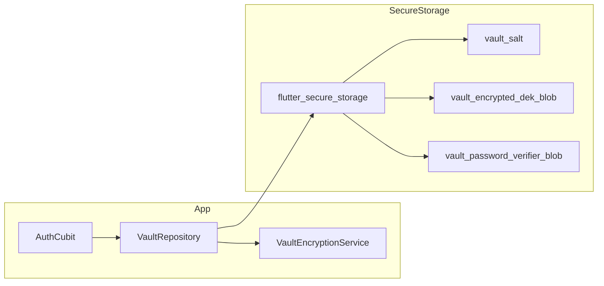

### What lives where

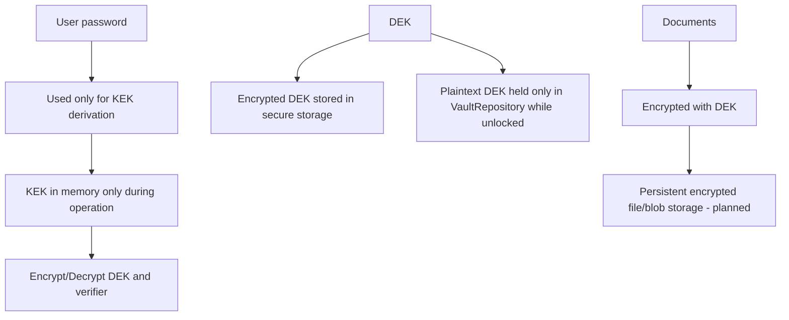

### SharedPreferences

Used for simple app preferences.

**Keys defined in `core/storage/shared_prefs_keys.dart`:**

No keys are currently defined. The file contains only a placeholder comment (`// sign up flag`) with no actual key constants.

### What Is NOT Implemented (Storage Layer)

- SQLCipher encrypted metadata database (`sqflite_sqlcipher` not in `pubspec.yaml`)
- File storage (`/vault/docs/`, `/vault/thumbs/`)
- Document model (id, title, type, path, thumbnail, timestamps)

---

## 8. Encrypted Blob Wire Format

**File:** `core/models/encryption/encrypted_blob_model.dart`

Every AES-256-GCM encrypted value is serialized as:

```
Offset 0-11:   Nonce        (12 bytes / 96-bit)
Offset 12-27:  MAC/Tag      (16 bytes)
Offset 28+:    Ciphertext   (N bytes)
              ─────────────
              Total overhead: 28 bytes
```

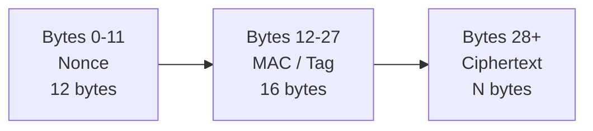

### Model Methods

- `EncryptedBlobModel(Uint8List)` — construct from wire format bytes
- `EncryptedBlobModel.validate(Uint8List)` — validate min length (>= 28 bytes) and construct
- `.bytes` — serialize back to wire format
- `.nonce` — extract 12-byte nonce from wire format
- `.mac` — extract 16-byte MAC from wire format
- `.ciphertext` — extract ciphertext from wire format

---

## 9. Routing & Navigation

**File:** `core/routes/route_config.dart`

Uses `go_router` with auth-state-based redirects.

### Routes

| Path              | Screen                  | Auth Required        |
| ----------------- | ----------------------- | -------------------- |
| `/`             | Redirect based on auth state | —                   |
| `/sign-up`      | `SignUpScreen`          | No (onboarding only) |
| `/login`        | `LoginScreen`           | No                   |
| `/home`         | `HomeScreen`            | Yes                  |
| `/delete-account` | `DeleteAccountScreen` | Yes (authenticated only) |

### Redirect Logic

```
AuthStatus.onboarding     → /sign-up
AuthStatus.unauthenticated → /login
AuthStatus.authenticated   → /home
AuthStatus.vaultLocked     → /login
/delete-account           → redirect to /login if not authenticated
```

### Navigation Service

`NavigationService` wraps `GoRouter` with route history tracking for back navigation.

---

## 10. Dependency Injection

**File:** `injectables/injectable.dart`

Uses `GetIt` + `injectable` for compile-time DI.

### Registered Singletons

| Class                        | Scope     | Annotation                                   |
| ---------------------------- | --------- | -------------------------------------------- |
| `VaultEncryptionService`   | Singleton | `@lazySingleton`                           |
| `VaultStorageService`      | Singleton | `@lazySingleton`                           |
| `VaultRepository`          | Singleton | `@lazySingleton`                           |
| `AuthCubit`                | Singleton | `@lazySingleton`                           |
| `BiometricServiceImpl`     | Singleton | `@LazySingleton(as: BiometricService)`     |
| `SecureStorageServiceImpl` | Singleton | `@LazySingleton(as: SecureStorageService)` |
| `SharedPrefsServiceImpl`   | Singleton | `@LazySingleton(as: SharedPrefsService)`   |
| `NavigationService`        | Singleton | —                                           |
| `ResponsiveService`        | Singleton | —                                           |
| `FlutterSecureStorage`     | Singleton | via`SecureStorageModule`                   |
| `SharedPreferences`        | Singleton | via`SharedPrefsModule` (pre-resolved)      |

### Dependency Relationships

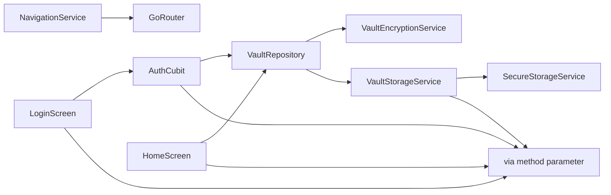

### Bootstrap Flow

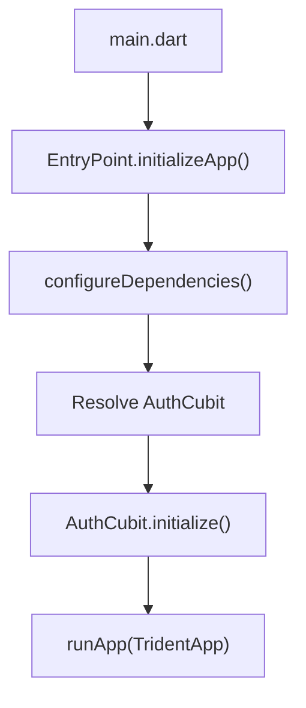

---

## 11. UI Architecture

### High-level UI Architecture

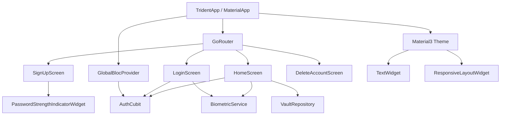

### State ownership

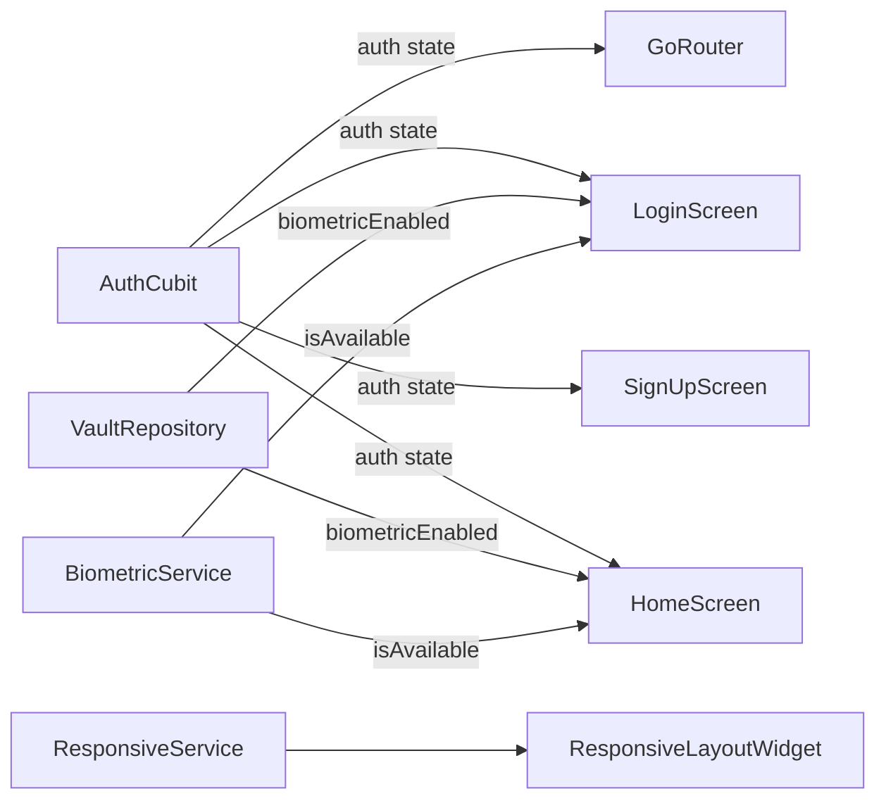

### State Management

- **BLoC/Cubit** pattern via `flutter_bloc`
- `AuthCubit` manages authentication state
- Base states: `NormalState` (Initial/Loading/Success/Failure) and `PaginationState`

### Theme

- Material3 dark theme
- Color palette: muted blue primary, soft green secondary
- Custom `TextWidget` with 15 built-in typography styles
- Custom fonts: GoogleSans (regular + italic)

### Responsive Layout

- `ResponsiveService` detects device type (mobile/tablet), orientation, and width class
- `ResponsiveLayoutWidget` provides breakpoint-based layouts (mobilePortrait, mobileLandscape, tabletPortrait, tabletLandscape)

---

## 12. Dependencies

### Core

| Package                     | Purpose                                  |
| --------------------------- | ---------------------------------------- |
| `flutter`                 | Framework                                |
| `flutter_bloc`            | State management (BLoC/Cubit)            |
| `get_it` + `injectable` | Dependency injection                     |
| `go_router`               | Declarative routing                      |
| `cryptography`            | Argon2id + AES-256-GCM                   |
| `flutter_secure_storage`  | Encrypted KV storage (Keystore/Keychain) |
| `flutter_screenutil`      | Responsive sizing                        |
| `shared_preferences`      | Simple KV preferences                    |
| `path_provider`           | File system paths                        |
| `url_launcher`            | External URL opening                     |

### In Use

| Package        | Purpose                                          |
| -------------- | ------------------------------------------------ |
| `local_auth` | Biometric authentication (Face ID / Fingerprint) |

### Declared but Unused

| Package                   | Status                                             |
| ------------------------- | -------------------------------------------------- |
| `fpdart`                | Functional programming — declared, never imported |
| `collection`            | Declared, only used transitively by`nested`      |
| `flutter_windowmanager` | Screenshot protection — commented out             |

### Missing (Specified in README but Not in pubspec.yaml)

| Package               | Purpose                     |
| --------------------- | --------------------------- |
| `sqflite_sqlcipher` | Encrypted metadata database |
| `file_picker`       | Document import             |
| `uuid`              | Document ID generation      |

---

## 13. Security Practices

### Memory Safety

- **KEK zeroing**: `_zero()` method overwrites `Uint8List` with zeros in `finally` blocks, guaranteeing cleanup on every exit path (success and failure)
- **DEK lifetime**: Only exists in `VaultRepository._dek`; zeroed on `lockVault()`
- **BUK zeroing**: Zeroed in `finally` block after biometric DEK decryption
- **No plaintext persistence**: Decrypted data exists only in RAM during active operations

### Constant-Time Comparison

Password verification uses `_constantTimeEquals()` — XOR-based comparison to prevent timing side-channel attacks.

### Wrong Password Detection

AES-GCM's built-in MAC verification catches wrong passwords via `SecretBoxAuthenticationError`, which is caught and re-thrown as `WrongPasswordException`.

### Secure Storage

- Android: Backed by Android Keystore
- iOS: Backed by iOS Keychain, iCloud sync disabled
- Never stores documents or decrypted keys — only wrapped key material

### Route Protection

`GoRouter` redirects prevent navigation to protected screens without authentication.

---

## 14. What Is Implemented vs Planned

### Implemented (Working)

- [X] Complete cryptographic core (Argon2id + AES-256-GCM)
- [X] Vault creation flow (password → salt → KEK → DEK → encrypted storage)
- [X] Vault unlock flow (password → derive KEK → verify → decrypt DEK)
- [X] Vault lock (DEK zeroed from memory)
- [X] Password verification via known-plaintext technique
- [X] Auth state machine with all 4 states
- [X] Secure storage layer with iOS edge cases handled
- [X] DI framework with all registrations generated
- [X] GoRouter navigation with auth-guarded routes
- [X] Sign-up screen with real-time password strength indicator
- [X] Login screen with error handling
- [X] Full dark theme design system
- [X] Responsive layout infrastructure
- [X] Reusable widget library
- [X] BLoC state abstractions
- [X] Logger infrastructure
- [X] Biometric authentication (Face ID / Fingerprint unlock)
|- [X] Account deletion (vault wipe + secure storage destruction + onboarding redirect)
|- [X] Delete account confirmation screen with "type DELETE to confirm" safety pattern

### Not Implemented (Planned)

- [ ] Document import (file_picker not in dependencies)
- [ ] Document storage (no file I/O, no /vault/ directory)
- [ ] Document viewing/decryption for user content
- [ ] SQLCipher encrypted metadata database
- [ ] Document model (id, title, type, path, thumbnail, timestamps)
- [ ] Document export/backup (.vaultbackup format)
- [ ] Backup restore
- [ ] Auto-lock (background detection, idle timeout)
- [ ] Screenshot protection (flutter_windowmanager commented out)
- [ ] Chunk-based encryption for large files
- [ ] Stream-based processing for memory efficiency
- [ ] Root/jailbreak detection
- [ ] Meaningful tests (only default Flutter counter test remains)

---

## 15. Known Issues & Gaps

1. **HomeScreen bug**: Reads `Future<String?>` from secure storage and calls `.toString()`, which displays `Instance of 'Future<String?>'` instead of actual values
2. **`fpdart` dependency**: Declared in pubspec.yaml but never imported
3. **Test coverage**: Only default Flutter counter test exists; no crypto or auth tests
4. **`flutter_windowmanager`**: Commented out in pubspec.yaml; screenshot protection not enforced

---

*This document reflects the codebase as of the current state. Update as new features are implemented.*
